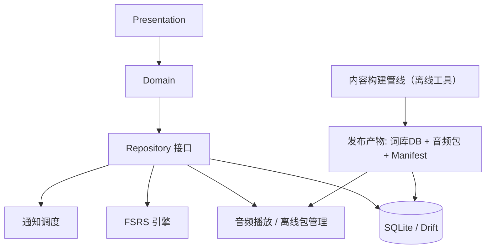
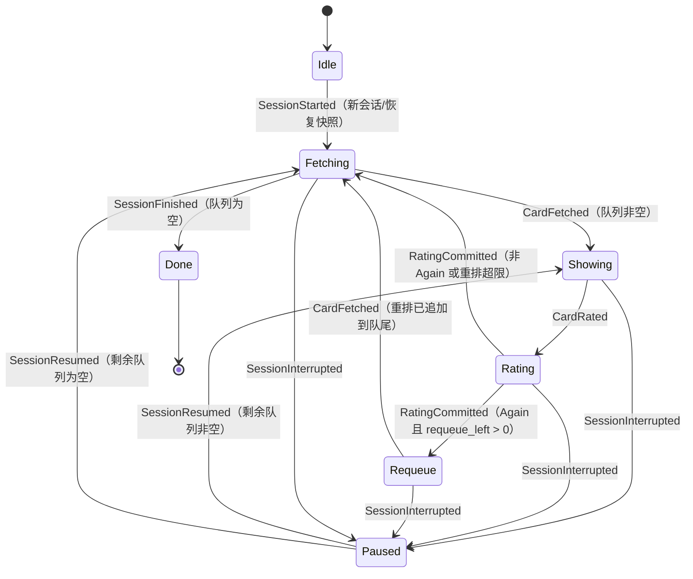
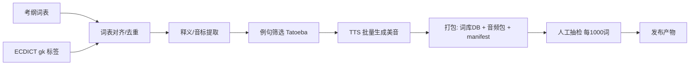

# 背单词软件技术文档（TECH_DOC v1.0）

> 关联文档：[PRD.md](./PRD.md)（v0.3 定稿，决策已确认）
> 状态：v1.1；技术决策已全部确认（2026-08-12），可进入开发
> 读者：Android/跨平台开发工程师、测试、内容运营、后续接手的维护者

---

## 1. 技术目标与约束

本文档所有技术方案均服务于 PRD 的核心目标：**打开就能背、每天几分钟、间隔重复 + 高质量内容 + 低门槛习惯**。由此导出以下技术约束：

> 应用信息：产品名 **我爱背单词**；Android applicationId：`com.woaibeidanci.app`（首次发布前可调整）；远程仓库托管于 GitHub。

| 编号 | 约束 | 来源 |
|---|---|---|
| T-01 | 首版仅 Android，架构必须预留 iOS 移植；Web 仅作管理后台 | PRD §8 |
| T-02 | 离线可用：词库与发音支持离线下载；核心学习流程不因网络中断 | PRD §8 |
| T-03 | 学习流程启动到首卡 < 2 秒；翻卡无卡顿；复习队列 1000+ 词流畅 | PRD §8 |
| T-04 | 学习数据本地存储为主（SQLite），可选云同步；MVP 不做账号体系 | PRD §8 |
| T-05 | 复习中途退出不丢进度，重新进入从当前队列继续 | PRD §8 |
| T-06 | 所有评分记录本地持久化，支持导出 | PRD §4/F4 |
| T-07 | 复习安排采用成熟算法（FSRS 优先，SM-2 备选），不自研 | PRD §6 F4 |
| T-08 | 不收集与学习无关的数据；目标用户含未成年人，最小化采集 | PRD §8 |
| T-09 | 免费工具，不做商业化；应用内保留 ECDICT / Tatoeba / 考纲词表署名 | PRD §7.2 |

架构的总体策略：**本地优先（Local-first）、单机单用户、离线包按需下载、算法引擎与 UI 解耦**。MVP 中不存在后端服务，一切可运行的能力都必须在无网环境下成立。

---

## 2. 总体架构

### 2.1 分层架构

```
┌─────────────────────────────────────────────────────────┐
│  Presentation 层（UI）                                    │
│  Onboarding / 今日任务 / 学习 / 复习 / 统计 / 设置 / 关于  │
├─────────────────────────────────────────────────────────┤
│  Domain 层（纯逻辑，可单测，可复用 iOS）                    │
│  FSRS 调度引擎 · 会话状态机 · 每日计划计算 · 队列排序       │
│  统计/打卡计算 · 高考倒计时计划                            │
├─────────────────────────────────────────────────────────┤
│  Data 层                                                   │
│  本地 SQLite（Drift）· 词库导入 · 离线包管理 · 音频播放器   │
│  通知调度 · 数据导出 · 设置存储                            │
└─────────────────────────────────────────────────────────┘
```

核心原则：

1. **Domain 层零框架依赖**：FSRS 引擎、会话状态机、队列排序均为纯逻辑，不依赖 Flutter/Android API，保证可单测、可在未来 iOS 端复用。
2. **Data 层为 Domain 提供仓储接口**：UI 不直接读写数据库，通过 Repository 访问。
3. **单向数据流**：用户操作 → Domain 计算 → 状态变更 → UI 重建，避免散落的状态同步。

### 2.2 模块依赖图



### 2.3 运行期数据流（每日闭环）

```
今日任务页
  → 读取用户状态（新词剩余量、到期复习词）
  → 计算今日计划（新词 N + 复习 M，M 受软上限约束）
  → 学习会话：逐卡评分，写 user_words + review_logs
  → 复习会话：FSRS 调度，答错词同会话内重排
  → 任务完成页：写 daily_stats，更新连续打卡
```

---

## 3. 技术选型

### 3.1 客户端框架

**推荐：Flutter 3.x（Dart 3）+ Material 3。**

| 方案 | 优点 | 缺点 | 结论 |
|---|---|---|---|
| **Flutter（推荐）** | 一套代码覆盖 Android + 未来 iOS + Web 管理端；UI 一致性好；本地优先场景生态成熟 | 包体略大（约 15–20 MB）；原生平台能力需插件 | 契合 T-01 与"免费工具、团队小、要快"的现实 |
| Kotlin + Jetpack Compose | Android 原生体验与性能最佳；Compose 开发效率高 | iOS 需完全重写（或 KMP 重写业务层） | 备选：若确认永远不做 iOS 则更优 |
| React Native | JS 生态、热更新 | 性能与后台任务控制弱于前两者；离线 DB/音频方案偏绕 | 不推荐 |

> 若采用 Flutter，**Domain 层天然跨端**，iOS 移植时仅重写 Presentation 与部分平台插件。

### 3.2 核心依赖选型

| 领域 | 选择 | 理由 / 备注 |
|---|---|---|
| 状态管理 | Riverpod 2.x | 编译期安全、易测试；社区主流 |
| 本地数据库 | Drift（基于 SQLite，启用 WAL） | 类型安全、迁移友好；满足 T-04 |
| 间隔重复算法 | **FSRS-5**（移植自官方 Python 参考实现） | 开源、参数可调、Anki 验证；备选 SM-2（见第 7 章） |
| 本地通知 | flutter_local_notifications + timezone | 每日提醒；Android 13+ 需 POST_NOTIFICATIONS 权限 |
| 音频播放 | just_audio（在线流 + 本地文件统一接口） | 支持预加载与缓存；例句发音 M2 复用 |
| 后台下载 | WorkManager（Android）封装 + 前台服务 | 离线包断点续传、Wi-Fi 策略 |
| i18n | Flutter 官方 l10n（ARB 文件） | 界面中英双语（F7） |
| 深色模式 | Material 3 主题系统 | 低成本（F7） |
| CI | GitHub Actions（analyze + test + build APK） | 见第 14 章 |

### 3.3 内容管线技术

词库构建为**离线工具链**（仓库内 `tools/content_pipeline/`），不随 App 分发：

| 阶段 | 技术 | 说明 |
|---|---|---|
| 词表对齐 | Python 脚本 + ECDICT SQLite | 考纲词表 ∩ ECDICT `gk` 标签，去重、规范大小写 |
| 释义/音标 | ECDICT 直接取用 | 取最常用 1–3 义项，标注词性 |
| 例句筛选 | Tatoeba 全库 SQL 过滤 + 词频过滤 | 句长 ≤ 18 词、覆盖目标词、避开超纲难词，保留署名 |
| 音频生成 | Edge TTS 批量脚本（离线运行） | 美音，逐词 mp3；英音 M2 |
| 质检 | 抽检清单脚本 + 人工 | 每 1000 词抽检，见第 10 章 |
| 打包 | 构建脚本生成 词库DB + 音频zip + manifest | 产物带版本号与 SHA-256，见第 10 章 |

---

## 4. 模块与目录结构（Flutter 参考）

```text
lib/
  main.dart
  app/                    # 应用装配：主题、路由、国际化（l10n/）、依赖注入
  core/                   # 基础设施：Result 类型、日志、时间工具、常量
  data/
    local/                # Drift 表定义（tables/）、DAO、迁移脚本
    repositories/         # 仓储实现（domain/services 中接口的具体实现）
    sources/              # 词库导入、离线包下载、音频在线源
  domain/
    models/               # Wordbook / Word / UserWord / ReviewLog / Settings…
    scheduling/           # FSRS 引擎（fsrs/）、Scheduler 接口、队列构建与排序、软上限
    sessions/             # 学习/复习会话状态机（纯逻辑）
    services/             # 仓储接口（契约）+ 每日计划、打卡/统计、倒计时计划、导出
  features/
    onboarding/           # 首次启动：选词书 → 每日目标 → 熟词跳过
    home/                 # 今日任务页
    learn/                # 学习模式（卡片 + 三键反馈）
    review/               # 复习模式（四类题型）
    results/              # 任务完成页（打卡、明日预告）
    stats/                # 统计页
    settings/             # 设置页
    about/                # 关于 / 数据来源署名
tools/
  content_pipeline/       # 词库构建、例句筛选、TTS、打包（见第 10 章）
test/
  domain/                 # FSRS、会话状态机、队列排序、计划计算的单测
  integration/            # 全流程集成测试
```

> 结构补充说明（2026-08-12 骨架落地时确认）：
> 1. **仓储接口定义在 `domain/services/`**，`data/repositories/` 只放实现，保证 `domain` 不依赖 `data`（AGENTS §3.2 依赖方向）；各仓储接口文件按“一个接口一个文件”组织。
> 2. **数据库表定义位于 `data/local/tables/`**（一表一文件），`app_database.dart` 负责装配与连接，`migrations.dart` 承载 schema 版本与迁移策略。
> 3. **国际化**：ARB 与生成物均位于 `lib/app/l10n/`。Flutter 3.44 起 gen-l10n 不再生成 synthetic package，`app_localizations*.dart` 生成物随源码提交（便于离线构建与静态分析），改动 ARB 后需运行 `flutter gen-l10n` 并一并提交。

---

## 5. 核心流程设计

### 5.1 启动与初始化

1. 打开 App → 初始化数据库（WAL、迁移）→ 读取设置与词书状态。
2. 首次启动进入 **Onboarding**（选词书 → 设每日目标 → 熟词跳过 → 开始）；再次启动直达今日任务页。
3. 今日任务页计算：
   - 待学新词 = min(每日目标, 词书剩余新词，按"高频→中频→低频"优先）；
   - 待复习 = 所有 `due_date <= 今日结束` 的词，按逾期严重度排序，截取软上限（默认 300）。
4. 若存在未完成的会话快照（T-05），进入时提示"继续上次未完成的学习"，恢复原队列。

### 5.2 学习会话（新词）

卡片流程：正面（单词 + 音标 + 发音按钮）→ 翻面（释义 1–3 条 + 例句 + 词根词缀可选）→ 三键反馈（认识/模糊/不认识）。

会话内规则：

- **不认识（Again）**：本次会话内立即回到队尾，**至少再出现一次**；若再次答错最多再重排一次（每词每会话最多 2 次重排，防止无限循环）；会话结束后的下次复习间隔由 FSRS 学习步骤决定（10 分钟）。
- **模糊（Hard）**：按官方 FSRS-5 学习步骤语义停留在 Learning，下次间隔 = 首个学习步骤 × 1.5（TD-05 下为 15 分钟），不直接毕业（毕业仅由 Good/Easy 触发，见 7.3 注）。
- **认识（Good）**：推迟首次复习，由 FSRS 计算（通常 3–7 天）。
- 每张卡作答后立即写 `user_words` 与 `review_logs`；写库失败不影响队列推进（先内存队列、批量落库）。

### 5.3 复习会话（旧词）

题型按记忆阶段分配：

| 阶段条件 | 题型 |
|---|---|
| 早期 / 高频词 / 上次答错 | 认识/不认识快速判断 |
| 中期（reps ≥ 2） | 看词选义（四选一） |
| 反向强化（间隔 ≥ 2 天） | 看义选词 |
| 模糊/常错词（lapses ≥ 1） | 拼写 |
| 进阶（可关闭） | 听音辨义 |

每题作答后有即时反馈（释义、例句、发音）。**答错立即回到队尾，本次会话内至少再见一次**（同样最多重排 2 次）。

### 5.4 会话状态机（学习与复习共用）



事件推进（实现 `DefaultSessionStateMachine`，纯逻辑，不读写数据库、不执行 FSRS 计算、不生成随机）：

- `SessionStarted`：进入会话；新会话携带 `sessionId + sessionType + initialWordIds`，恢复会话携带 `SessionSnapshot`，据此全量重建队列。
- `CardFetched`：从 `Requeue` 进入 `Fetching`（仅推进阶段，重排追加已在 `RatingCommitted` 完成）；从 `Fetching` 取下一张卡进入 `Showing`。
- `CardRated`：用户作答，携带 FSRS `Rating`（Again=1/Hard=2/Good=3/Easy=4）。状态机只记录"是否重排"；FSRS 调度与落库由调用方在事件外完成。
- `RatingCommitted`：调用方完成评分处理（FSRS + 写库）后触发；`Again 且 requeue_left > 0` → 移除队首、把该词追加到队尾、`requeue_left - 1`、进入 `Requeue`；否则仅移除队首、进入 `Fetching`。**Hard/Good/Easy 一律不重排。**
- `SessionInterrupted`：可从 Fetching/Showing/Rating/Requeue 任意活动阶段进入 `Paused` 并产出快照。
- `SessionResumed`：按快照重建队列；剩余队列非空 → `Showing`（队首卡），为空 → `Fetching`（等待 `SessionFinished`）。
- `SessionFinished`：仅允许在 `Fetching` 且队列为空时触发，进入 `Done` 并清空快照。

重排规则（§5.2/§5.3 口径确认，2026-08-12 实现时明确）：

- 重排判定 = **Again（评分 1）且该词剩余重排次数 > 0**；`requeue_left` 初始为 2（会话内最大重排次数，§18），每次重排减 1，减到 0 后再答错按答对推进（仅移除、不再入队），防止单次会话无限循环。
- "回到队尾"即追加到剩余队列末尾；每个词在任意时刻至多有一个待展示 occurrence，`session_items` 按 `(session_id, word_id)` 一行一卡成立（§8.1）。

快照与恢复语义（TD-07 口径确认，2026-08-12 实现时明确）：

- `SessionSnapshot.items` 只含**剩余队列**（已答卡不重复，重排卡除外），按 `seq` 升序排列；`seq` 为剩余队列内 0 起连续下标。
- `SessionSnapshot.position` = **已消费卡数**（本次会话已作答并离开队列的卡数），即 `sessions.position` 的进度语义；恢复时仅作进度恢复，下一张卡恒为剩余队列队首。
- 中断在 `Showing`：当前卡尚未消费，快照含队首卡，恢复后重新展示同一张卡。
- 中断在 `Rating`：作答未提交（`RatingCommitted` 未触发），当前卡视为未消费，恢复后重新作答。
- 中断在 `Requeue`：重排已生效，快照含追加到队尾的重排卡（`requeue_left` 已减一），恢复后先展示队首的下一张卡。
- 会话进入 `Done` 后 `snapshot` 置空；快照持久化与删除由调用方负责，状态机不写数据库。全部完成后由调用方写 `daily_stats` 并进入任务完成页。

---

## 6. 每日计划计算

### 6.1 常规模式

```
新词数   = min(dailyGoal, wordbook 剩余新词数)
复习队列 = due_date <= 今日结束 的词，按逾期严重度排序
复习数   = min(len(复习队列), reviewCap)   // 默认 300，可调/关闭
顺延     = len(复习队列) - 复习数           // 保持原 due_date，次日自然排在最前
```

实现为纯逻辑，不读写数据库：`dailyGoal`、词书剩余新词数、到期词列表
（`due_date <= 今日结束`，由仓储查询）、`reviewCap` 与"今日零点"（见 6.2）
均由调用方（今日任务页 → 仓储）传入。契约见
`lib/domain/services/daily_plan_calculator.dart`（实现：
`lib/domain/services/default_daily_plan_calculator.dart`），结果 `DailyPlan`
（`lib/domain/models/daily_plan.dart`）包含 `newWordCount`、`reviewQueue`
（已排序并截断）、`reviewCount` 与 `deferredCount`。

### 6.2 复习队列排序（逾期严重度）

定义 `overdueDays = floor((今日零点 - due_date) / 1天)`，排序键：

1. 主键：`overdueDays` 降序（最逾期最优先）；
2. 次键：`stability` 升序（不稳定的词更优先）；
3. 三键：`word_id` 升序（确定性，便于测试）。

超出软上限的词**不修改 due_date**，次日自动排在最前，实现"按逾期严重程度顺延"且无惩罚语义（补卡机制，PRD §6 F2）。

> 口径说明（2026-08-12 实现时确认）：
> - "今日零点"（`todayStart`）由调用方按调度时区（§18，默认 Asia/Shanghai）
>   换算为当日 00:00:00 后传入构建器；构建器只做纯算术，不感知时区。
> - `overdueDays` 按天向下取整：正值 = 已逾期天数；`0` = 昨日到期（未满 1 天）
>   或恰为今日零点到期；`-1` = 今日零点之后到期（尚未逾期）。同日到期归入同一桶，
>   桶内按次键/三键排序。
> - 到期词列表须已按 `due_date <= 今日结束` 过滤（仓储契约
>   `UserWordRepository.getDueWords`）；`due_date` 为空的词不进入该列表，
>   构建器兜底按今日到期处理。
> - 契约：`lib/domain/scheduling/review_queue_builder.dart`；实现：
>   `lib/domain/scheduling/default_review_queue_builder.dart`。

### 6.3 高考倒计时模式（M3）

输入考试日期后：

```
daysLeft        = 考试日 - 今日
suggestedNew    = ceil(剩余新词数 / daysLeft)
```

今日任务页显示建议值，用户目标低于建议值时提示"按当前速度将在考前 X 天完成 / 需提速到 Y 词/天"；完成度 = 已完成新词 / 剩余新词。

### 6.4 打卡与统计

- 连续打卡天数由 `daily_stats` 中"完成度 = 1"的日期计算，仅展示、不惩罚（F6）。
- 统计页数据：当日/累计新词、复习数、复习正确率（rating ≥ 3 记正确）、记忆曲线（按词的平均间隔增长，M2 可选）。

---

## 7. 间隔重复算法（FSRS-5）

### 7.1 采用方案

采用 **FSRS-5**（Anki 现行算法，MIT 开源），将官方 Python 参考实现移植为 Dart 纯函数库（放 `domain/scheduling/fsrs/`），并**引入官方 golden 测试用例**保证数值一致（见第 14 章）。备选 SM-2 仅在 FSRS 移植验证失败时启用，接口层（`Scheduler`）已抽象，切换成本低。

### 7.2 每个词维护的状态

| 字段 | 含义 |
|---|---|
| `state` | New / Learning / Review / Relearning |
| `step` | 学习/重学步骤下标（0 起；Learning/Relearning 时非空，Review 时为 null），对应官方实现 `Card.step` |
| `stability (S)` | 记忆稳定性（间隔的数学期望） |
| `difficulty (D)` | 词条难度因子（0–10） |
| `due_date` | 下次到期时间 |
| `reps` | 复习次数 |
| `lapses` | 遗忘次数 |
| `last_review_at` | 上次复习时间 |
| `elapsed_days` | 距上次复习天数（user_words 镜像字段；评分时计算，首次评分为空） |
| `scheduled_days` | 上次安排的间隔（user_words 镜像字段；本次评分后更新） |

> 说明：`reps`/`lapses` 计数器官方 py-fsrs 不维护，属本项目按 Anki 口径的本地扩展：每次评分 `reps + 1`；Review 状态评 Again（进入遗忘）时 `lapses + 1`。调度计算以 `last_review_at` 推导 elapsed_days，不读取镜像字段，保持"算法层不读数据库"。

### 7.3 评分映射

| UI 操作 | 内部评分 | 新词（Learning） | 复习词（Review） |
|---|---|---|---|
| 不认识 | Again (1) | 留在 Learning，due = +10 分钟 | 进入 Relearning，due = +10 分钟 |
| 模糊 | Hard (2) | 留在 Learning，due = +15 分钟（单步 [10m] 的 1.5 倍，官方学习步骤语义） | 正常更新 S/D，间隔缩短 |
| 认识 | Good (3) | 毕业为 Review，间隔由 FSRS 给出（约 3 天） | 正常推进间隔 |
| 认识（长按/高级） | Easy (4) | 跳过学习步骤直接毕业，间隔约 16 天 | 大幅推进间隔 |

学习步骤配置：`learning_steps = [10m]`，`relearning_steps = [10m]`；目标记忆保持率（desired retention）默认 **0.9**，可在算法参数配置中调整。

> 注（2026-08-12 FSRS 移植时校准）：毕业（Learning/Relearning → Review）仅由 Good（最后一步）或 Easy 触发；Again 重置步骤、Hard 保持步骤不变，二者均停留在 Learning/Relearning，不进入复习队列。这与 PRD F3"模糊和不认识进入复习队列"的产品表述不一致，实现以官方 FSRS-5 语义为准，PRD 表述待产品确认（差异详见汇报）。

### 7.4 调度规则

- 每次评分后调用 FSRS 状态转移：更新 S、D、due_date、reps、lapses，写 `review_logs`（含当时的 S/D/间隔，供导出与调参）。
- 复习日期由算法输出；今日队列由"逾期严重度"排序（第 6.2 节）。
- 参数首次使用官方默认值（FSRS-5 默认参数表），上线后可用本地 `review_logs` 做参数优化（重跑训练脚本，M3 可选）。
- 移植基准：官方 Python 参考实现 **py-fsrs v5.1.3**（FSRS-5 最终版本，19 参数模型）。fsrs4anki v6 的 21 参数扩展（w[19]/w[20] 与 toFixed(2) 取整）本次未采用，差异详见汇报。
- **fuzz 默认关闭**（`enableFuzzing = false`）：官方默认开启随机微扰，本项目为调度确定性与测试可复现性默认关闭；引擎保留官方 fuzz 区间算法，后续可按需开启。
- 间隔计算使用 Python `round()`（银行家舍入）语义；复习间隔取整日，学习/重学步骤按分钟计。

### 7.5 正确性保障

1. 移植后跑通官方 golden 用例：官方 py-fsrs v5.1.3 测试序列的 S/D/间隔/retrievability 断言，参考值由官方实现全精度生成，断言容差 1e-6。
2. 时间全部以 `DateTime` 存储 epoch 毫秒，调度计算使用"本地日边界"（Asia/Shanghai 时区优先，设置内可改）。
3. 算法层不读数据库，输入为"词状态 + 评分 + 当前时间"，输出为"新状态 + 日志"，可整层单元测试。

### 7.6 领域接口映射（骨架调整记录，2026-08-12）

| 骨架接口 | 调整 | 原因 |
|---|---|---|
| `CardState` | 新增 `step`（int?） | 对应官方 `Card.step`，学习/重学步骤推进是官方状态机的一部分 |
| `SchedulingState` | 改为承载完整更新后的 `CardState` + `intervalDays` + `retrievability` | 对齐官方 `review_card` 返回的 (Card, ReviewLog) 数据，便于直接持久化 `user_words` |
| `FsrsParameters` | 新增 `weights`（官方 19 参数默认表）、`maximumIntervalDays`（36500）、`enableFuzzing`（默认 false） | TECH_DOC §7.4 所需参数项 |

引擎实现位置：`domain/scheduling/fsrs/fsrs_engine.dart`（状态转移）、`fsrs_formulas.dart`（纯公式）、`fsrs_defaults.dart`（官方默认参数与常量）。

---

## 8. 数据模型与存储设计

### 8.1 数据库设计（SQLite / Drift）

```sql
-- 词书
CREATE TABLE wordbooks (
  id          INTEGER PRIMARY KEY,
  name        TEXT NOT NULL,            -- 高考大纲词汇 3500
  level       TEXT NOT NULL,            -- gaokao / xkb
  total_count INTEGER NOT NULL,
  source      TEXT NOT NULL,            -- ECDICT + 考纲
  sort_order  INTEGER NOT NULL DEFAULT 0,
  created_at  INTEGER NOT NULL
);

-- 词条（内容静态数据，随词库包发布）
CREATE TABLE words (
  id          INTEGER PRIMARY KEY,
  word        TEXT NOT NULL UNIQUE,
  phonetic    TEXT NOT NULL,            -- 美式 IPA
  phonetic_uk TEXT,                     -- 英式 IPA（M2）
  meanings    TEXT NOT NULL,            -- JSON: [{"pos":"n.","meaning":"..."}]
  examples    TEXT NOT NULL,            -- JSON: [{"en":"...","zh":"...","source":"Tatoeba","attribution":"..."}]
  frequency   TEXT NOT NULL,            -- high / medium / low
  root_affix  TEXT,                     -- JSON 可选：词根词缀
  audio_key   TEXT NOT NULL,            -- 离线包内音频文件名（不含扩展名）
  audio_url   TEXT,                     -- 在线兜底 URL
  created_at  INTEGER NOT NULL
);

-- 词书-词关联（含学习顺序）
CREATE TABLE wordbook_items (
  wordbook_id INTEGER NOT NULL,
  word_id     INTEGER NOT NULL,
  seq         INTEGER NOT NULL,         -- 词表原始顺序
  shuffled    INTEGER NOT NULL,         -- 首启乱序后的学习顺序（确定性种子）
  is_skipped  INTEGER NOT NULL DEFAULT 0, -- 熟词跳过
  PRIMARY KEY (wordbook_id, word_id)
);

-- 用户学习状态（每个词一行，FSRS 调度核心）
CREATE TABLE user_words (
  user_id        INTEGER NOT NULL DEFAULT 0,  -- 本地单用户预留
  wordbook_id    INTEGER NOT NULL,
  word_id        INTEGER NOT NULL,
  state          TEXT NOT NULL,               -- new/learning/review/relearning
  status         TEXT NOT NULL,               -- learning/review/mature（业务层派生）
  due_date       INTEGER,
  stability      REAL NOT NULL DEFAULT 0,
  difficulty     REAL NOT NULL DEFAULT 0,
  reps           INTEGER NOT NULL DEFAULT 0,
  lapses         INTEGER NOT NULL DEFAULT 0,
  last_review_at INTEGER,
  last_rating    INTEGER,
  elapsed_days   REAL,
  scheduled_days REAL,
  PRIMARY KEY (user_id, wordbook_id, word_id)
);

-- 复习日志（追加式，可导出）
CREATE TABLE review_logs (
  id            INTEGER PRIMARY KEY AUTOINCREMENT,
  user_id       INTEGER NOT NULL DEFAULT 0,
  wordbook_id   INTEGER NOT NULL,
  word_id       INTEGER NOT NULL,
  rating        INTEGER NOT NULL,            -- 1=Again 2=Hard 3=Good 4=Easy
  reviewed_at   INTEGER NOT NULL,
  interval_days REAL,
  stability     REAL,
  difficulty    REAL,
  session_id    TEXT,
  session_type  TEXT NOT NULL                -- learning / review
);

-- 会话快照（退出续学）
CREATE TABLE sessions (
  id           TEXT PRIMARY KEY,             -- UUID
  session_type TEXT NOT NULL,                -- learning / review
  created_at   INTEGER NOT NULL,
  updated_at   INTEGER NOT NULL,
  position     INTEGER NOT NULL DEFAULT 0    -- 已消费卡数（进度，§5.4）
);

CREATE TABLE session_items (
  session_id   TEXT NOT NULL,
  word_id      INTEGER NOT NULL,
  seq          INTEGER NOT NULL,             -- 剩余队列顺序（0 起连续，§5.4）
  requeue_left INTEGER NOT NULL DEFAULT 0,   -- 该词剩余重排次数
  PRIMARY KEY (session_id, word_id)
);

-- 设置（每日目标、软上限、发音、语言、提醒、题型开关、考试日期）
CREATE TABLE settings (
  key   TEXT PRIMARY KEY,
  value TEXT NOT NULL
);

-- 每日统计（打卡/曲线）
CREATE TABLE daily_stats (
  day           TEXT PRIMARY KEY,            -- YYYY-MM-DD
  new_count     INTEGER NOT NULL DEFAULT 0,
  review_count  INTEGER NOT NULL DEFAULT 0,
  correct_count INTEGER NOT NULL DEFAULT 0,
  completed     INTEGER NOT NULL DEFAULT 0
);

-- 离线包下载状态
CREATE TABLE audio_packs (
  wordbook_id      INTEGER PRIMARY KEY,
  version          TEXT NOT NULL,
  status           TEXT NOT NULL,            -- not_downloaded / downloading / ready
  total_size       INTEGER,
  downloaded_size  INTEGER,
  file_count       INTEGER,
  updated_at       INTEGER
);

-- 索引
CREATE INDEX idx_user_words_due ON user_words(status, due_date);
CREATE INDEX idx_review_logs_time ON review_logs(reviewed_at);
CREATE INDEX idx_session_items ON session_items(session_id, seq);
```

### 8.2 存储与导出

- 数据库启用 WAL 模式，单写连接；后台批量写日志时合并事务。
- 词库静态数据（words / wordbooks）以**发布版本 DB 文件**导入（见第 10 章），用户数据表独立；词库升级时做 `words` 表整体替换并保留 `word_id` 稳定性（以 word 文本 + 版本作为映射键）。
- 数据导出：`review_logs` + `user_words` 导出为 CSV/JSON（设置页触发，系统分享面板输出），满足 F4"为用户未来迁移兜底"。

### 8.3 新词学习顺序（乱序的确定性）

首次进入词书时，用 `seed = hash(wordbook_id, 设备安装时间)` 生成 `shuffled` 序号并持久化；此后新词按 `shuffled` 递增取用，同频段内优先（先 high → medium → low）。这样：

- 默认乱序（避免首字母聚类干扰记忆）；
- 进度稳定，不会因重启/换天导致顺序漂移；
- 考前突击时可切换"按词表顺序"。

---

## 9. 音频与离线包设计

### 9.1 播放策略（在线优先 + 离线包）

```
播放请求 → 离线包已含该词？ → 是：播本地文件
                            → 否：播 audio_url（HTTP 流），同时写入内存/磁盘 LRU 缓存
```

- 首次使用默认在线播放；离线包在后台下载完成后自动切换本地（F5）。
- 翻卡前预加载后续 2 张卡的音频，避免播放卡顿。
- 例句发音（M2）使用同一管线与缓存策略。

### 9.2 离线包格式与下载

离线包发布物：

```text
gaokao-3500-v1.2/
  manifest.json        # {"version":"1.2","wordbook_id":1,"file_count":3500,
                       #  "total_size":...,"sha256":{...},"created_at":...}
  audio/000001.mp3
  audio/000002.mp3
  ...
```

下载实现要求：

- 基于 WorkManager 的后台任务，**前台服务保活**（Android 大文件下载在后台受限）；
- HTTP Range 断点续传，进度写入 `audio_packs.downloaded_size`；
- 下载完成后校验 manifest 中的 SHA-256，通过后原子替换目录并置 `status=ready`；
- Wi-Fi 下自动下载；蜂窝网络默认不自动下载（设置可开启，F5）；
- 支持按词书下载/删除；设置页展示体积预估（3500 词约 50–100 MB）与当前状态；
- 下载失败可重试（指数退避），不阻塞学习流程。

---

## 10. 词库内容管线

### 10.1 构建流程



### 10.2 各阶段规则

| 阶段 | 规则 |
|---|---|
| 词表对齐 | 以教育部考纲词表为基准；ECDICT `gk` 标签交叉验证；大小写规范化、去重；产出词表 JSON（约 3500 词） |
| 释义/音标 | 从 ECDICT 取**最常用 1–3 个义项**，标注词性，义项顺序按词频排序 |
| 例句 | Tatoeba 全库过滤：句长 ≤ 18 词、包含目标词、句子用词不超出高中词汇集（按 BNC/COCA 词频阈值）、优先短句；每词 1–2 句；保留句子 ID 与作者署名信息 |
| 音频 | Edge TTS 美音批量生成，每词 1 个 mp3（目标码率 48–96 kbps，单词时长约 1–2 秒）；文件命名 `audio_key = 词表序号` 保持稳定 |
| 质检 | 每 1000 词人工抽检：释义顺序正确、例句难度不超高中阅读、音频清晰无吞音；不合格词条打回对应阶段 |
| 打包 | 词库 DB（words/wordbooks/wordbook_items）+ 音频 zip + manifest（版本、SHA-256）；产物上传对象存储/CDN，App 按版本拉取 |

### 10.3 署名与合规

应用内"关于/数据来源"页固定展示：教育部《高考英语考试大纲》词表、ECDICT（MIT）、Tatoeba（CC BY 2.0 FR，含例句署名）、TTS 引擎来源。满足 PRD §7.2 合规说明。

---

## 11. 通知与后台任务

### 11.1 每日提醒

- 默认开启、可关闭（F6）；提醒时间存 `settings.reminder_time`，默认如 20:00。
- 实现：`flutter_local_notifications` 精确时间本地通知；跨时区用 timezone 包处理。
- Android 13+ 运行时申请 `POST_NOTIFICATIONS`；用户在系统层关闭时 App 内给出引导而非反复弹窗。

### 11.2 离线包下载

- WorkManager：Wi-Fi 约束 + 充电可选；前台服务用于保活与进度展示。
- 断点续传与校验见第 9.2 节。

---

## 12. 性能设计

| 指标（PRD §8） | 实现策略 |
|---|---|
| 启动到首卡 < 2 秒 | 数据库延迟初始化（首页先渲染骨架）；今日队列首次查询仅取 count；卡片数据按需分页加载；启动不阻塞网络 |
| 翻卡无卡顿 | 卡片数据一次取 50 张进内存队列；音频预加载后续 2 张；避免 build 期 DB 访问 |
| 复习队列 1000+ 词流畅 | `user_words(status, due_date)` 索引；队列只取前 200 张分批渲染，滑动按需补充；日志批量事务写入 |
| 存储 | WAL 模式、单写连接；`daily_stats` 按天 upsert |
| 内存 | 例句/释义 JSON 惰性解析；音频只保留当前会话 LRU |

---

## 13. 安全、隐私与合规

### 13.1 数据安全

- 学习数据全部本地存储，不设账号、不上传（MVP）；数据库文件位于应用私有目录。
- 未来云同步（M3）采用用户显式导出/导入或端到端加密同步，不上传可识别个人身份的信息。

### 13.2 隐私与未成年人保护

目标用户含未成年人（PRD §8），遵循最小化采集原则：

- 不收集姓名、手机号、定位、通讯录等任何与学习无关数据；
- 无第三方统计 SDK（避免学习记录外流）；如后续引入崩溃收集，仅采集崩溃堆栈且可关闭；
- 应用商店隐私政策声明中明确数据本地存储、不共享学习记录；
- 无广告 SDK、无支付 SDK，从源头降低合规与隐私风险（与 F6/3.2 免费定位一致）。

### 13.3 内容合规

- 保留数据来源署名（第 10.3 节）；
- 词库与例句版权来源均为开放协议数据，见 PRD §7.2。

---

## 14. 测试与质量保障

### 14.1 单元测试（Domain 层）

| 模块 | 用例 |
|---|---|
| FSRS 引擎 | 官方 golden 用例数值断言；评分映射；Learning→Review 状态转移；Relearning 逻辑 |
| 队列排序 | 逾期严重度排序；软上限截断与顺延；次日恢复 |
| 会话状态机 | 答错重排（≤2 次）；中断恢复；完成后清理快照 |
| 每日计划 | 常规模式、倒计时模式、词书耗尽边界 |
| 打卡/统计 | 连续天数计算、正确率 |

### 14.2 集成与端到端

- `integration_test`：Onboarding → 学习 3 词 → 复习 → 完成页全流程；
- 中断恢复测试：学习中途 kill 进程 → 重启 → 队列一致；
- 离线场景：飞行模式下完成全部核心流程；
- 词库版本升级迁移测试（v1→v2 数据不丢）。

### 14.3 CI 与发布

- GitHub Actions：`flutter analyze` + `flutter test` + `integration_test`（Android 模拟器）+ 构建 release APK；
- 词库产物发布走独立 workflow（内容管线），产物带版本号；App 内检查版本并提示更新离线包。

---

## 15. 里程碑与交付物映射

| 阶段 | 技术交付物 | 验收标准（对应 PRD §10） |
|---|---|---|
| **M1 MVP** | Android 端（Flutter）+ 高考 3500 词书（含例句）、学习/复习会话、FSRS-5 调度、在线+离线发音、每日目标、复习软上限、熟词跳过、深色模式、本地 SQLite、会话续学、数据导出 | 高中生可完成为期 7 天完整学习闭环；启动首卡 < 2s；飞行模式可用；中断可续 |
| **M2** | 新课标词书、例句/词根增强、生词本、高考倒计时、统计页、学习周报、英音、界面英文版 | 词书覆盖高考全场景；周报可生成分享图 |
| **M3** | 云同步（可选）、自定义词书导入、分享打卡、FSRS 参数优化 | 留存指标达标后评估 |

---

## 16. 风险与应对

| 风险 | 影响 | 应对 |
|---|---|---|
| FSRS Dart 移植数值不一致 | 复习间隔不可信 | 官方 golden 测试（1e-6 精度）；失败则回退 SM-2（接口已抽象） |
| TTS 音频质量参差 | 发音体验差 | 每 1000 词抽检；质量不达标词条重生成 |
| 离线包 50–100 MB 下载失败率高（GitHub Releases 国内偏慢） | 离线功能形同虚设 | 断点续传 + 前台服务 + 分片校验；在线兜底不阻塞学习；必要时切换国内 OSS |
| ECDICT 释义/义项顺序不合高中场景 | 内容质量受损 | 义项按考纲语境人工校正 + 抽检 |
| Android 后台下载/通知限制（厂商 ROM） | 提醒与下载失效 | 前台服务 + 引导用户加白名单；提醒仅是辅助，不依赖其完成核心闭环 |
| 词库升级导致用户进度错位 | 学习数据损坏 | word_id 以"word 文本 + 版本"映射，升级前备份用户表 |
| 未成年人隐私合规审查 | 上架风险 | 无账号、无第三方 SDK、隐私政策明确本地存储 |

---

## 17. 技术决策记录（已确认）

以下为本文档在 PRD 基础上新增的技术决策，已于 2026-08-12 与产品方确认：

| # | 决策点 | 结论 | 备选 |
|---|---|---|---|
| TD-01 | 客户端框架 | Flutter 3.x + Material 3 | Kotlin + Compose（若确定不做 iOS） |
| TD-02 | 状态管理 | Riverpod 2.x | Bloc |
| TD-03 | 本地存储 | Drift（SQLite + WAL） | sqflite 裸 SQL |
| TD-04 | 复习算法 | FSRS-5（Dart 移植 + 官方 golden 测试） | SM-2 |
| TD-05 | 学习步骤 | learning_steps=[10m]，目标保持率 0.9 | 可按内容质量调参 |
| TD-06 | 乱序实现 | 首启种子乱序并持久化（确定性） | 每日重新洗牌（不推荐，进度漂移） |
| TD-07 | 会话续学 | 独立 sessions/session_items 快照表 | 仅内存恢复（不满足 T-05） |
| TD-08 | 音频格式 | mp3，48–96 kbps，按词表序号命名 | opus（压缩率更高，但播放兼容性低） |
| TD-09 | 词库分发 | 发布版 DB 文件 + 音频 zip + manifest | 内置全部内容（包体过大） |
| TD-10 | 数据导出 | CSV/JSON 经系统分享面板 | 仅云同步（MVP 无后端，不可行） |
| TD-11 | 离线包托管 | GitHub Releases（免费） | 国内 OSS（下载更快，需账号与费用） |
| TD-12 | 分发方式 | MVP 阶段 APK 直装，商店上架后置 | 直接上架（需软著/隐私政策，周期长） |
| TD-13 | 应用名称/包名 | 我爱背单词 / com.woaibeidanci.app | 首次发布前可改 |

---

## 18. 附录：核心常量与默认值

| 配置项 | 默认值 | 说明 |
|---|---|---|
| 每日新词数 | 20（可选 10/20/30/50） | PRD F2 |
| 复习软上限 | 300 词/天 | 可调/关闭，PRD F2 |
| desired retention | 0.9 | FSRS 参数 |
| learning_steps | [10m] | 新词/重学词答错后 |
| 会话内最大重排次数 | 2 | 防止单次会话无限循环 |
| 提醒时间 | 20:00 | 可调，默认开启 |
| 离线包预估 | 50–100 MB / 3500 词 | PRD F5 |
| 例句筛选 | 句长 ≤ 18 词、高中词汇范围 | PRD §7.2 |
| 时区 | Asia/Shanghai（可设置） | 调度日边界 |
