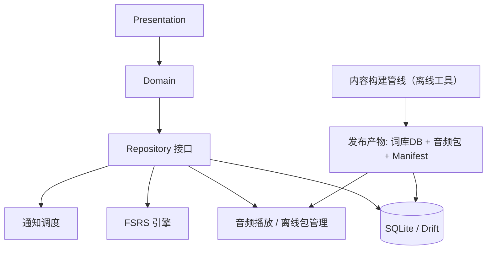
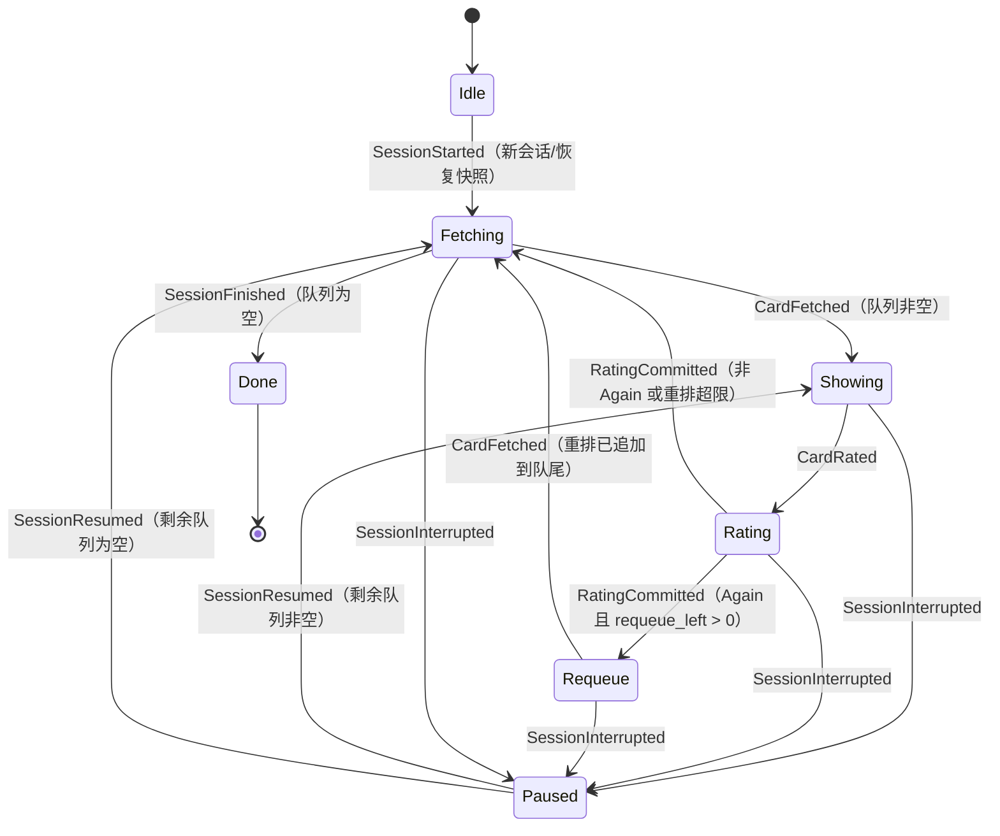
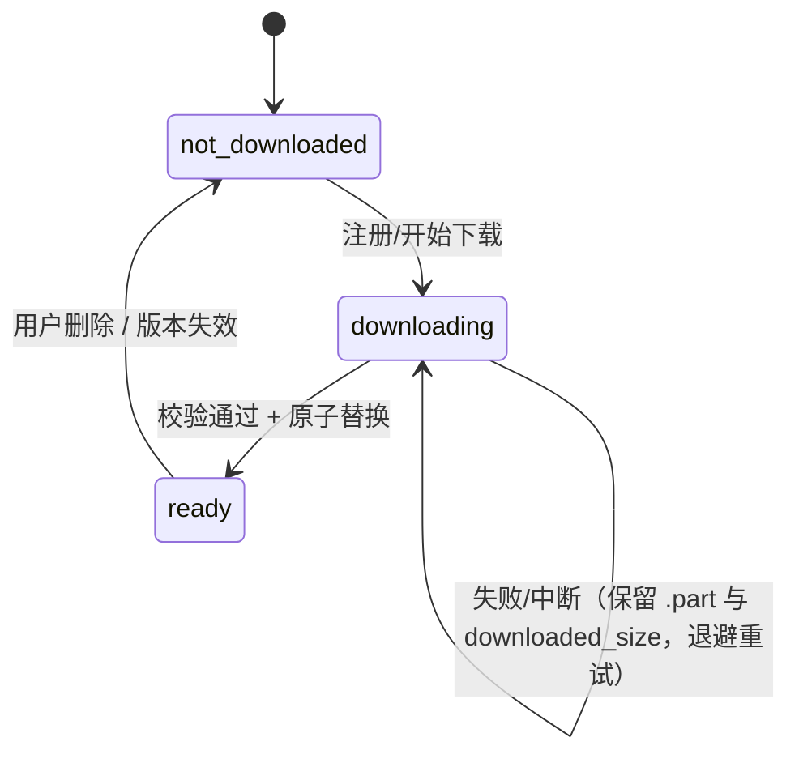

# 背单词软件技术文档（TECH_DOC v1.0）

> 关联文档：[PRD.md](./PRD.md)（v0.3 定稿，决策已确认）
> 状态：v1.3；技术决策已全部确认（2026-08-12），可进入开发
> v1.3 变更：TD-06 运行时乱序初始化落地（确定性种子持久化 + 词库升级同种子
> 重排，见 §4/§5.1/§8.3）
> v1.2 变更：M1 Onboarding 最小版落地（首启判定、路由、词书选择口径与熟词跳过取舍，见 §4/§5.1）
> 读者：Android/跨平台开发工程师、测试、内容运营、后续接手的维护者

---

## 1. 技术目标与约束

本文档所有技术方案均服务于 PRD 的核心目标：**打开就能背、每天几分钟、间隔重复 + 高质量内容 + 低门槛习惯**。由此导出以下技术约束：

> 应用信息：产品名 **我爱背单词**；Android applicationId：`com.woaibeidanci.app`（首次发布前可调整）；远程仓库托管于 GitHub。

| 编号 | 约束 | 来源 |
|---|---|---|
| T-01 | 首版仅 Android，架构必须预留 iOS 移植；Web 仅作管理后台 | PRD §8 |
| T-02 | 离线可用：词库与发音支持离线下载；核心学习流程不因网络中断 | PRD §8 |
| T-03 | 学习流程启动到首卡 < 2 秒；翻卡无卡顿；复习队列 1000+ 词流畅 | PRD §8 |
| T-04 | 学习数据本地存储为主（SQLite），可选云同步；MVP 不做账号体系 | PRD §8 |
| T-05 | 复习中途退出不丢进度，重新进入从当前队列继续 | PRD §8 |
| T-06 | 所有评分记录本地持久化，支持导出 | PRD §4/F4 |
| T-07 | 复习安排采用成熟算法（FSRS 优先，SM-2 备选），不自研 | PRD §6 F4 |
| T-08 | 不收集与学习无关的数据；目标用户含未成年人，最小化采集 | PRD §8 |
| T-09 | 免费工具，不做商业化；应用内保留 ECDICT / Tatoeba / 考纲词表署名 | PRD §7.2 |

架构的总体策略：**本地优先（Local-first）、单机单用户、离线包按需下载、算法引擎与 UI 解耦**。MVP 中不存在后端服务，一切可运行的能力都必须在无网环境下成立。

---

## 2. 总体架构

### 2.1 分层架构

```
┌─────────────────────────────────────────────────────────┐
│  Presentation 层（UI）                                    │
│  Onboarding / 今日任务 / 学习 / 复习 / 统计 / 设置 / 关于  │
├─────────────────────────────────────────────────────────┤
│  Domain 层（纯逻辑，可单测，可复用 iOS）                    │
│  FSRS 调度引擎 · 会话状态机 · 每日计划计算 · 队列排序       │
│  统计/打卡计算 · 高考倒计时计划                            │
├─────────────────────────────────────────────────────────┤
│  Data 层                                                   │
│  本地 SQLite（Drift）· 词库导入 · 离线包管理 · 音频播放器   │
│  通知调度 · 数据导出 · 设置存储                            │
└─────────────────────────────────────────────────────────┘
```

核心原则：

1. **Domain 层零框架依赖**：FSRS 引擎、会话状态机、队列排序均为纯逻辑，不依赖 Flutter/Android API，保证可单测、可在未来 iOS 端复用。
2. **Data 层为 Domain 提供仓储接口**：UI 不直接读写数据库，通过 Repository 访问。
3. **单向数据流**：用户操作 → Domain 计算 → 状态变更 → UI 重建，避免散落的状态同步。

### 2.2 模块依赖图



### 2.3 运行期数据流（每日闭环）

```
今日任务页
  → 读取用户状态（新词剩余量、到期复习词）
  → 计算今日计划（新词 N + 复习 M，M 受软上限约束）
  → 学习会话：逐卡评分，写 user_words + review_logs
  → 复习会话：FSRS 调度，答错词同会话内重排
  → 任务完成页：写 daily_stats，更新连续打卡
```

---

## 3. 技术选型

### 3.1 客户端框架

**推荐：Flutter 3.x（Dart 3）+ Material 3。**

| 方案 | 优点 | 缺点 | 结论 |
|---|---|---|---|
| **Flutter（推荐）** | 一套代码覆盖 Android + 未来 iOS + Web 管理端；UI 一致性好；本地优先场景生态成熟 | 包体略大（约 15–20 MB）；原生平台能力需插件 | 契合 T-01 与"免费工具、团队小、要快"的现实 |
| Kotlin + Jetpack Compose | Android 原生体验与性能最佳；Compose 开发效率高 | iOS 需完全重写（或 KMP 重写业务层） | 备选：若确认永远不做 iOS 则更优 |
| React Native | JS 生态、热更新 | 性能与后台任务控制弱于前两者；离线 DB/音频方案偏绕 | 不推荐 |

> 若采用 Flutter，**Domain 层天然跨端**，iOS 移植时仅重写 Presentation 与部分平台插件。

### 3.2 核心依赖选型

| 领域 | 选择 | 理由 / 备注 |
|---|---|---|
| 状态管理 | Riverpod 2.x | 编译期安全、易测试；社区主流 |
| 本地数据库 | Drift（基于 SQLite，启用 WAL） | 类型安全、迁移友好；满足 T-04 |
| 间隔重复算法 | **FSRS-5**（移植自官方 Python 参考实现） | 开源、参数可调、Anki 验证；备选 SM-2（见第 7 章） |
| 本地通知 | flutter_local_notifications 22.3.0 + timezone 0.11.1 | 每日提醒（§11.1）；Android 13+ 需 POST_NOTIFICATIONS 权限；timezone 数据随包（约 200 KB）；Android 需启用 core library desugaring（`compileOptions.isCoreLibraryDesugaringEnabled` + `desugar_jdk_libs 2.1.4`，插件官方要求） |
| 音频播放 | just_audio 0.10.6（在线流 + 本地文件统一接口） | M1 发音接入（2026-08-13）；支持预加载与缓存；例句发音 M2 复用；Android 依赖 ExoPlayer |
| 后台下载 | workmanager 0.10.7（Android 封装 + 前台服务） | 离线包断点续传、Wi-Fi 策略；dataSync 前台服务需 gradle 属性 `workmanager.enableDataSyncForegroundService=true`（§11.2）；Android 侧引入 androidx.work 原生依赖 |
| 解压 | archive 4.0.9（纯 Dart） | 离线包 zip 解压与原子替换（§9.2），无原生依赖，体积影响约 200 KB |
| 系统分享 | share_plus 13.3.0 | 数据导出经系统分享面板（§8.2 导出）；Android 侧走 ACTION_SEND，无额外权限 |
| i18n | Flutter 官方 l10n（ARB 文件） | 界面中英双语（F7） |
| 深色模式 | Material 3 主题系统 | 低成本（F7） |
| CI | GitHub Actions（analyze + test + build APK） | 见第 14 章 |

### 3.3 内容管线技术

词库构建为**离线工具链**（仓库内 `tools/content_pipeline/`），不随 App 分发：

| 阶段 | 技术 | 说明 |
|---|---|---|
| 词表对齐 | Python 脚本 + ECDICT SQLite | 考纲词表 ∩ ECDICT `gk` 标签，去重、规范大小写 |
| 释义/音标 | ECDICT 直接取用 | 取最常用 1–3 义项，标注词性 |
| 例句筛选 | Tatoeba 全库 SQL 过滤 + 词频过滤 | 句长 ≤ 18 词、覆盖目标词、避开超纲难词，保留署名 |
| 音频生成 | Edge TTS 批量脚本（离线运行） | 美音，逐词 mp3；英音 M2 |
| 质检 | 抽检清单脚本 + 人工 | 每 1000 词抽检，见第 10 章 |
| 打包 | 构建脚本生成 词库DB + 音频zip + manifest | 产物带版本号与 SHA-256，见第 10 章 |

---

## 4. 模块与目录结构（Flutter 参考）

```text
lib/
  main.dart
  app/                    # 应用装配：主题、路由、国际化（l10n/）、依赖注入
  core/                   # 基础设施：Result 类型、日志、时间工具、常量
  data/
    local/                # Drift 表定义（tables/）、DAO、迁移脚本
    repositories/         # 仓储实现（domain/services 中接口的具体实现）
    sources/              # 词库导入、离线包下载、音频在线源
  domain/
    models/               # Wordbook / Word / UserWord / ReviewLog / Settings…
    scheduling/           # FSRS 引擎（fsrs/）、Scheduler 接口、队列构建与排序、软上限
    sessions/             # 学习/复习会话状态机（纯逻辑）
    services/             # 仓储接口（契约）+ 每日计划、打卡/统计、倒计时计划、导出
  features/
    onboarding/           # 首次启动：选词书 → 每日目标 → 熟词跳过
    home/                 # 今日任务页
    learn/                # 学习模式（卡片 + 三键反馈）
    review/               # 复习模式（四类题型）
    results/              # 任务完成页（打卡、明日预告）
    stats/                # 统计页
    settings/             # 设置页
    about/                # 关于 / 数据来源署名
tools/
  content_pipeline/       # 词库构建、例句筛选、TTS、打包（见第 10 章）
test/
  domain/                 # FSRS、会话状态机、队列排序、计划计算的单测
  integration/            # 全流程集成测试
```

> 结构补充说明（2026-08-12 骨架落地时确认）：
> 1. **仓储接口定义在 `domain/services/`**，`data/repositories/` 只放实现，保证 `domain` 不依赖 `data`（AGENTS §3.2 依赖方向）；各仓储接口文件按“一个接口一个文件”组织。
> 2. **数据库表定义位于 `data/local/tables/`**（一表一文件），`app_database.dart` 负责装配与连接，`migrations.dart` 承载 schema 版本与迁移策略。
> 3. **国际化**：ARB 与生成物均位于 `lib/app/l10n/`。Flutter 3.44 起 gen-l10n 不再生成 synthetic package，`app_localizations*.dart` 生成物随源码提交（便于离线构建与静态分析），改动 ARB 后需运行 `flutter gen-l10n` 并一并提交。

> 结构补充说明（2026-08-12 TD-07 每日核心循环 UI 收口时新增）：
> 4. **页面路由与装配**：`lib/app/router.dart` 注册 home/learn/review/results 四路由；
>    v1.2 起增补 onboarding/splash 两路由（首启流程，§5.1）；
>    `lib/app/providers.dart` 提供数据库、各仓储、FSRS 调度器、每日计划计算器、
>    `SessionDriver` 与首启门卫 `onboardingGateProvider` 的 Riverpod provider
>    （驱动为 `autoDispose`，一场会话一实例，进入 Done 后不可复用，TECH_DOC §5.4）。
>    UI 不直接读写数据库（AGENTS §3.2）。
> 5. **学习/复习共用会话组件**：共用会话流程（`SessionFlow`，含取卡/评分/中断/完成
>    编排）与卡片/三键组件位于 `features/learn/`（`session_flow.dart`、
>    `widgets/session_card.dart`、`widgets/rating_buttons.dart`），复习页复用，
>    避免重复实现；学习与复习仅以 `SessionType` 与初始队列区分。待功能稳定后
>    可抽 `features/session/` 共享层再迁移。
> 6. **Onboarding（M1 最小版，2026-08-12 落地）**：首启流程为
>    「选词书 → 设每日目标 → 开始」单页（`features/onboarding/onboarding_page.dart`）；
>    启动经 `features/onboarding/splash_page.dart` 首帧判定
>    （`onboardingGateProvider`，§5.1）：`settings.onboarding_done=false`
>    （缺失按默认回填）→ 进入 `/onboarding`；`true` → 直达 `/`（今日任务页）。
>    每日目标与首启标记随 `SettingsRepository.save` 同事务落库（§8.1 settings），
>    中断/重复进入不会造成重复初始化。
> 7. **首启取舍（2026-08-12 本步明确）**：
>    - **熟词跳过（已实现，2026-08-13 单元 5 落地）**：Onboarding 提供
>      「标记已掌握词（可选）」入口，进入快筛页按词书全量/搜索标记
>      `wordbook_items.is_skipped`（§8.3 读写口径）；已标记词不再进入
>      “新词”序列（`getWordsByBook`/`countRemainingNewWords` 过滤，
>      §8.3），不影响既有学习/复习数据。
>    - **词书选择口径**：Onboarding 展示 `getWordbooks()` 并默认选中第一个；
>      M1 单词书场景下与今日页“默认第一个”等价（§5.1），暂不新增
>      `active_wordbook_id` 设置键；多词书选择持久化与
>      `UserWordRepository.getDueWords` 按词书过滤同属后续迭代。
>    - **TD-06 运行时乱序已落地（2026-08-15）**：`wordbook_items.shuffled` 由
>      今日页首载时按 §8.3 初始化（`ensureShuffledOrder`，幂等；settings 记录
>      种子与词书版本，词库升级后以同种子重排）。测试 fixture 与词库包预置
>      `shuffled = seq` 仅作为"未初始化"基线，不再承担乱序职责；表结构不变。

> 结构补充说明（2026-08-13 单元 4 设置页落地时新增）：
> 8. **路由与装配增补**：`lib/app/router.dart` 增补 `/settings`（设置页）与
>    `/about`（关于/数据来源，合规署名，§10.3）两路由，今日任务页 AppBar
>    提供设置入口；`App` 根组件经 `appSettingsProvider`
>    （`FutureProvider<AppSettings>`，`lib/app/providers.dart`）驱动
>    `MaterialApp.locale`（`settings.language`）与 `themeMode`
>    （`settings.themeMode`），设置页保存后 `invalidate` 该 provider 即时生效。
> 9. **设置页（M1 范围，PRD F7）**：覆盖每日目标（10/20/30/50）、复习软上限
>    （100/200/300/关闭，默认 300）、发音开关、蜂窝下载离线包、提醒开关与
>    提醒时间、界面语言（简体中文/English）、深色模式（跟随系统/浅色/深色）、
>    数据导出（CSV/JSON，§8.2）与「关于/数据来源」入口；全部经
>    `SettingsRepository.save` 全量写入（§8.1 通用键值表，无 schema 变更），
>    提醒时间/开关变更同步 `ReminderScheduler` 重排（§11.1）。语言默认
>    「跟随系统」（空串），选择后存 'zh'/'en'，`MaterialApp.locale` 仅在
>    非空时覆盖。

---

## 5. 核心流程设计

### 5.1 启动与初始化

1. 打开 App → 初始化数据库（WAL、迁移）→ 读取设置与词书状态。
2. 首次启动进入 **Onboarding**（选词书 → 设每日目标 → 开始；其中「标记已掌握词」
   为可选步骤，见 §4 补充说明 7 与 §8.3）；再次启动直达今日任务页。
   - **首启判定**：启动先经 `/splash` 首帧渲染，`onboardingGateProvider`
     读取 `settings.onboarding_done`（缺失按默认 `false` 回填，§18）；
     `false` → 进入 `/onboarding`，`true` → 直达 `/`。设置读取为异步，
     splash 等待期间不渲染今日页，避免首帧闪屏与重复初始化（§12）。
   - **完成落库**：Onboarding「开始」以 `SettingsRepository.save` 一次事务写入
     每日目标与 `onboarding_done=true`（原子、幂等），随后 `context.go('/')`
     直达今日任务页；再次启动不再进入 Onboarding。
   - **每日目标**：选项 10/20/30/50，默认 20（PRD F2 / §18），与
     `AppConstants.defaultDailyNewWords` 一致；词书选择默认选中第一个
     （多词书完整支持见 §4 补充说明 7）。
3. 今日任务页计算（TD-07 收口时明确的数据流，见 §6.1）：
   - 先经 `WordbookRepository.ensureShuffledOrder` 确保词书已完成首启乱序
     （TD-06，幂等；首次调用按确定性种子生成 `shuffled` 并持久化，词库升级
     后以同种子重排，见 §8.3），再计算待学/待复习；
   - 待学新词 = min(每日目标, 词书剩余新词，按"高频→中频→低频"优先）；
   - 待复习 = 所有 `due_date <= 今日结束` 的词，按逾期严重度排序，截取软上限（默认 300）。
   - 实现：今日页通过 `SettingsRepository.load` 读设置、`WordbookRepository` 取默认
     词书与剩余新词、`UserWordRepository.getDueWords` 取到期词（按当前词书过滤）后，
     交 `DefaultDailyPlanCalculator` 计算；结果仅用于展示与构建会话入口，不落库。
   - 首页展示口径（2026-08-15 修复）：卡片"待学新词" = 今日剩余待学新词 =
     max(0, 计划 `new_word_count` − 当日 `daily_stats.new_count`)，完成每日目标后
     归零，而不是始终显示整日计划量；同日新增"今日已学单词：xx 个"展示（数据源
     同上 `daily_stats`）。计算收敛在纯逻辑
     `DailyCheckinCalculator.remainingNewWordsToday`（§5.5 共用）。
   - 目标完成后"再学一组"（2026-08-15 产品确认）：今日剩余待学新词为 0 且词书
     仍有未学词时，"开始学习"按钮保持可点，点击弹出确认
     「今日学习任务已完成，是否再学习一组单词？」；确认后开一组学习会话，
     每组词数 = min(每日目标, 词书剩余新词)，学习/统计口径与常规会话一致
     （完成页判定不受影响，超学视为目标达成）。
4. 若存在未完成的会话快照（T-05），进入时提示"继续上次未完成的学习"，恢复原队列。
   - `SessionRepository.loadAll` 按 `updated_at` 降序返回未完成快照（最新会话优先）；
     MVP 多快照并存时仅提供最近一个“继续”入口，恢复后沿用该快照的会话类型与队列。
   - M1 单词书假设：到期词按当前默认词书过滤在今日页完成；多词书支持需扩展
     `UserWordRepository.getDueWords` 按词书过滤（后续迭代）。

### 5.2 学习会话（新词）

卡片流程：正面（单词 + 音标 + 发音按钮）→ 翻面（释义 1–3 条 + 例句 + 词根词缀可选）→ 三键反馈（认识/模糊/不认识）。

会话内规则：

- **不认识（Again）**：本次会话内立即回到队尾，**至少再出现一次**；若再次答错最多再重排一次（每词每会话最多 2 次重排，防止无限循环）；会话结束后的下次复习间隔由 FSRS 学习步骤决定（10 分钟）。
- **模糊（Hard）**：按官方 FSRS-5 学习步骤语义停留在 Learning，下次间隔 = 首个学习步骤 × 1.5（TD-05 下为 15 分钟），不直接毕业（毕业仅由 Good/Easy 触发，见 7.3 注）。
- **认识（Good）**：推迟首次复习，由 FSRS 计算（通常 3–7 天）。
- 每张卡作答后立即写 `user_words` 与 `review_logs`；写库失败不影响队列推进（先内存队列、批量落库）。

### 5.3 复习会话（旧词）

题型按记忆阶段分配：

| 阶段条件 | 题型 |
|---|---|
| 早期 / 高频词 / 上次答错 | 认识/不认识快速判断 |
| 中期（reps ≥ 2） | 看词选义（四选一） |
| 反向强化（间隔 ≥ 2 天） | 看义选词 |
| 模糊/常错词（lapses ≥ 1） | 拼写 |
| 进阶（可关闭） | 听音辨义 |

每题作答后有即时反馈（释义、例句、发音）。**答错立即回到队尾，本次会话内至少再见一次**（同样最多重排 2 次）。

> TD-07 阶段取舍：复习会话本步只实现“认识/不认识快速判断”卡片——与学习会话共用
> “卡片展示 + 三键反馈”（认识/模糊/不认识 → Good/Hard/Again，§7.3），评分后展示
> 释义/例句即时反馈；四选一、看义选词、拼写、听音辨义等题型分配（本表）属 M1
> 后续迭代，本步不实现。

### 5.4 会话状态机（学习与复习共用）



事件推进（实现 `DefaultSessionStateMachine`，纯逻辑，不读写数据库、不执行 FSRS 计算、不生成随机）：

- `SessionStarted`：进入会话；新会话携带 `sessionId + sessionType + initialWordIds`，恢复会话携带 `SessionSnapshot`，据此全量重建队列。
- `CardFetched`：从 `Requeue` 进入 `Fetching`（仅推进阶段，重排追加已在 `RatingCommitted` 完成）；从 `Fetching` 取下一张卡进入 `Showing`。
- `CardRated`：用户作答，携带 FSRS `Rating`（Again=1/Hard=2/Good=3/Easy=4）。状态机只记录"是否重排"；FSRS 调度与落库由调用方在事件外完成。
- `RatingCommitted`：调用方完成评分处理（FSRS + 写库）后触发；`Again 且 requeue_left > 0` → 移除队首、把该词追加到队尾、`requeue_left - 1`、进入 `Requeue`；否则仅移除队首、进入 `Fetching`。**Hard/Good/Easy 一律不重排。**
- `SessionInterrupted`：可从 Fetching/Showing/Rating/Requeue 任意活动阶段进入 `Paused` 并产出快照。
- `SessionResumed`：按快照重建队列；剩余队列非空 → `Showing`（队首卡），为空 → `Fetching`（等待 `SessionFinished`）。
- `SessionFinished`：仅允许在 `Fetching` 且队列为空时触发，进入 `Done` 并清空快照。

重排规则（§5.2/§5.3 口径确认，2026-08-12 实现时明确）：

- 重排判定 = **Again（评分 1）且该词剩余重排次数 > 0**；`requeue_left` 初始为 2（会话内最大重排次数，§18），每次重排减 1，减到 0 后再答错按答对推进（仅移除、不再入队），防止单次会话无限循环。
- "回到队尾"即追加到剩余队列末尾；每个词在任意时刻至多有一个待展示 occurrence，`session_items` 按 `(session_id, word_id)` 一行一卡成立（§8.1）。

快照与恢复语义（TD-07 口径确认，2026-08-12 实现时明确）：

- `SessionSnapshot.items` 只含**剩余队列**（已答卡不重复，重排卡除外），按 `seq` 升序排列；`seq` 为剩余队列内 0 起连续下标。
- `SessionSnapshot.position` = **已消费卡数**（本次会话已作答并离开队列的卡数），即 `sessions.position` 的进度语义；恢复时仅作进度恢复，下一张卡恒为剩余队列队首。
- 中断在 `Showing`：当前卡尚未消费，快照含队首卡，恢复后重新展示同一张卡。
- 中断在 `Rating`：作答未提交（`RatingCommitted` 未触发），当前卡视为未消费，恢复后重新作答。
- 中断在 `Requeue`：重排已生效，快照含追加到队尾的重排卡（`requeue_left` 已减一），恢复后先展示队首的下一张卡。
- 会话进入 `Done` 后 `snapshot` 置空；快照持久化与删除由调用方负责，状态机不写数据库。全部完成后由调用方写 `daily_stats` 并进入任务完成页。

#### 快照持久化（TD-07 落库口径，2026-08-12 确认）

- 契约：`lib/domain/services/session_repository.dart`（纯接口，不依赖 data/Flutter），
  实现 `lib/data/repositories/drift_session_repository.dart`（注入 `AppDatabase`）。
  调用方为今日任务页（§5.1 第 4 点"存在未完成会话"提示）与会话页（中断落库、启动恢复）；
  UI 不直接读写两表（AGENTS §3.2）。
- 保存（`save`）：`sessions` 一行 + `session_items` **全量替换**，在**同一个数据库事务**
  内完成（§8.2 单写连接 + 批量事务）。全量替换的原因：快照是剩余队列的唯一编码（TD-07），
  逐行 diff 无收益且易残留旧行；同事务的原因：两表必须同时可见或同时不可见，
  部分写入会制造"缺 sessions 行的 session_items"或旧 items 残留式损坏。
- 删除（`delete`）：`sessions` 与 `session_items` 两表**同事务**清理，会话进入 Done 后调用，
  保证不留下孤儿行。
- 加载（`load`/`loadAll`）：按 `seq` 升序读取 `session_items`，组装为 `SessionSnapshot`
  （`session_type` 用 `SessionType.storageValue` 映射），可直接交给状态机
  `SessionStarted.resume`；`loadAll` 返回全部未完成会话，供今日任务页枚举。
- 损坏/非法快照口径：`load`/`loadAll` **校验并抛出明确错误（`StateError`，含 sessionId 与
  原因），不静默丢弃、不自动修复**，与状态机 `_restoreFromSnapshot` 拒绝非法输入的口径一致。
  校验项：存在 `session_items` 但缺少 `sessions` 行（孤儿行）、`seq` 不连续、
  `position`/`requeueLeft`/`wordId` 为负、未知 `session_type`。仅当整个 sessionId
  不存在任何行时 `load` 返回 null；`session_items` 为空视为合法快照（队列已清空但未完成，
  等待 `SessionFinished`）。
- 时间戳语义：首次插入 `created_at`/`updated_at` 均填当前时间；覆盖保存（同 sessionId
  再次 `save`）保留 `created_at`、刷新 `updated_at`，单位为 epoch 毫秒（§7.5）。
  `word_id` 唯一性由 `(session_id, word_id)` 主键保证（§8.1）。

#### 会话驱动（SessionDriver）契约（2026-08-12 会话驱动落地时新增）

- 职责与位置：`lib/domain/sessions/session_driver.dart`，纯逻辑（不依赖
  data/Flutter，AGENTS §3.2），注入 `SessionStateMachine` + `FsrsScheduler` +
  `UserWordRepository` / `ReviewLogRepository` / `SessionRepository` /
  `StatsRepository` 接口。驱动**不修改状态机与 FSRS 引擎的任何行为**，其语义以
  既有单测为准；UI 通过驱动访问会话，不直接操作状态机。
  **驱动实例与一次会话一一对应**：状态机进入 Done 后不可再次
  `SessionStarted`（`_start` 仅允许从 Idle 发起），UI 每场会话（学习/复习）
  新建一个驱动实例。
- 事件映射：
  - `startNewSession`（新会话）→ `SessionStarted.fresh`；
    `resumeSession`（恢复快照，快照由调用方先经 `SessionRepository.load`
    取得）→ `SessionStarted.resume`；
  - `fetchCard` → 把 `CardFetched`（Requeue→Fetching 与 Fetching→Showing 两次
    事件）折叠为一次取卡，返回当前展示词；仅允许在 Requeue/Fetching 阶段调用；
  - `rate(rating)` → `CardRated` → 驱动完成 FSRS 调度与落库（user_words +
    review_logs）→ `RatingCommitted`（§5.4"拆分为独立事件的原因"：状态机不在
    评分时立即消费卡片，调度与持久化由驱动在两次事件之间完成）；
  - `interrupt` → `SessionInterrupted` → `SessionRepository.save`（同事务，
    §5.4 快照持久化）；
  - `finish` → `SessionFinished` → `SessionRepository.delete` +
    `StatsRepository` 合并写 daily_stats（全部完成后由调用方写 daily_stats，
    §5.4）。
- 落库时序与失败口径（§5.2"写库失败不影响队列推进"的驱动实现）：
  每次评分立即写 user_words 与 review_logs；两个写操作各自失败重试 1 次，
  重试后仍失败则通过注入的日志回调记录并**继续推进队列**（仍触发
  `RatingCommitted`），`rate` 返回 `persistFailures` 计数供 UI 提示。已知后果：
  该次评分的 user_words/review_logs 可能缺失（或部分成功），调度正确性以
  user_words 为准（§7.2 镜像字段不参与算法计算），日志缺失仅影响导出与调参
  （T-06/§7.4）；已消费卡在本会话内不再出现，缺失的评分由该词按旧状态下次
  到期重新调度兜底，不破坏学习闭环；快照（TD-07）保证队列推进可恢复。
- 中断/恢复/完成时序：
  - `interrupt`：快照保存失败**向上抛出**（区别于评分写库的"记录日志继续"），
    因为快照是恢复的唯一依据（TD-07），静默丢弃违反 T-05；
    已处于 Paused（保存失败后重试）时跳过状态机事件、直接重存快照，
    使中断保存可幂等重试；
  - `finish`：先校验队列为空并触发 `SessionFinished`（完成数据在触发前捕获，
    因状态机进入 Done 后清空 position 等元数据），再删除快照（幂等），最后
    合并写 daily_stats；任一持久化失败向上抛出，驱动保留本次会话的完成数据，
    调用方可重试 `finish`——快照删除幂等、daily_stats 先读后合并写，重试不会
    重复计数；
  - 恢复会话的 `wordbookId` 由调用方提供：sessions 表无 wordbook_id（§8.1），
    TD-07 快照不含词书信息；今日任务页持有当前词书上下文，恢复时一并传入。
- daily_stats 写入方式：`finish` 按会话类型累加——learning →
  `new_count += 已消费卡数`；review → `review_count += 已消费卡数`、
  `correct_count += 评分 ≥ 3 的次数`（§6.4）。先 `getByDay` 读当日，合并后
  `upsert`，避免覆盖同日其他会话的计数；`completed` 打卡标记由任务完成页在
  整日任务完成后写入，驱动不置位。
- 字段口径（2026-08-12 会话驱动实现时明确）：
  - `user_words.status` 派生：state=review 且 `scheduled_days ≥ 21` →
    mature（Anki 口径的"间隔足够长"阈值，PRD §4"掌握"定义），state=review →
    review，其余（new/learning/relearning）→ learning；
  - `user_words` 无 step 列（§8.1），当前单步学习/重学配置（TD-05）下
    learning/relearning 的 step 恒为 0，恢复后按 0 处理不影响调度；若未来启用
    多步学习步骤，需先同步 §8.1 加列、迁移脚本并与用户确认。

### 5.5 任务完成页与打卡判定（2026-08-12 TD-07 收口时新增）

- 会话 finish 后进入任务完成页：页面读取当日 `daily_stats`（含本场会话由
  `SessionDriver.finish` 累加的计数）与重算的今日计划，展示今日累计进度。
- **整日任务完成判定（产品口径，与 PRD §5 任务完成页对齐）**：
  `daily_stats.new_count ≥ 今日计划 new_word_count` **且**
  `daily_stats.review_count ≥ 今日计划 review_count`；
  被复习软上限顺延的词（未进入计划队列、保持原 due_date，§6.1）**不阻塞打卡**。
  实现为纯逻辑 `DailyCheckinCalculator.isTodayComplete(plan, stats)`
  （`lib/domain/services/daily_checkin_calculator.dart`），可单测。
- 判定满足时置 `daily_stats.completed = 1`（打卡，用于连续打卡天数，§6.4），
  并展示“明日预告 + 鼓励文案”（PRD §5）；不满足时不置位，展示进度差并引导
  继续（回到今日页）。`completed` 置位由任务完成页负责，`SessionDriver` 不置位
  （§5.4 驱动契约）。
- 口径说明：复习计数含会话内重排的重复出现（驱动按已消费卡数累加，§5.4），
  因此“完成整场计划队列”后必然满足 `review_count ≥ 计划 review_count`；
  顺延词因重算计划时仍到期但未进入队列（数量 ≤ 软上限），同样不阻塞判定。
- 剩余进度共用口径：完成页"还差 N 个新词"与首页"待学新词"卡片共用
  `DailyCheckinCalculator.remainingNewWordsToday(plan, stats)`（2026-08-15，
  §5.1 首页展示口径），避免两处各自计算导致显示不一致。

---

## 6. 每日计划计算

### 6.1 常规模式

```
新词数   = min(dailyGoal, wordbook 剩余新词数)
复习队列 = due_date <= 今日结束 的词，按逾期严重度排序
复习数   = min(len(复习队列), reviewCap)   // 默认 300，可调/关闭
顺延     = len(复习队列) - 复习数           // 保持原 due_date，次日自然排在最前
```

> 首页展示口径：卡片"待学新词"为**今日剩余量**（§5.1），即
> max(0, 计划 `new_word_count` − 当日 `daily_stats.new_count`），非计划量本身；
> 计划量仍按本公式计算并用于完成页打卡判定（§5.5）。

实现为纯逻辑，不读写数据库：`dailyGoal`、词书剩余新词数、到期词列表
（`due_date <= 今日结束`，由仓储查询）、`reviewCap` 与"今日零点"（见 6.2）
均由调用方（今日任务页 → 仓储）传入。契约见
`lib/domain/services/daily_plan_calculator.dart`（实现：
`lib/domain/services/default_daily_plan_calculator.dart`），结果 `DailyPlan`
（`lib/domain/models/daily_plan.dart`）包含 `newWordCount`、`reviewQueue`
（已排序并截断）、`reviewCount` 与 `deferredCount`。

### 6.2 复习队列排序（逾期严重度）

定义 `overdueDays = floor((今日零点 - due_date) / 1天)`，排序键：

1. 主键：`overdueDays` 降序（最逾期最优先）；
2. 次键：`stability` 升序（不稳定的词更优先）；
3. 三键：`word_id` 升序（确定性，便于测试）。

超出软上限的词**不修改 due_date**，次日自动排在最前，实现"按逾期严重程度顺延"且无惩罚语义（补卡机制，PRD §6 F2）。

> 口径说明（2026-08-12 实现时确认）：
> - "今日零点"（`todayStart`）由调用方按调度时区（§18，默认 Asia/Shanghai）
>   换算为当日 00:00:00 后传入构建器；构建器只做纯算术，不感知时区。
> - `overdueDays` 按天向下取整：正值 = 已逾期天数；`0` = 昨日到期（未满 1 天）
>   或恰为今日零点到期；`-1` = 今日零点之后到期（尚未逾期）。同日到期归入同一桶，
>   桶内按次键/三键排序。
> - 到期词列表须已按 `due_date <= 今日结束` 过滤（仓储契约
>   `UserWordRepository.getDueWords`）；`due_date` 为空的词不进入该列表，
>   构建器兜底按今日到期处理。
> - 契约：`lib/domain/scheduling/review_queue_builder.dart`；实现：
>   `lib/domain/scheduling/default_review_queue_builder.dart`。

### 6.3 高考倒计时模式（M3）

输入考试日期后：

```
daysLeft        = 考试日 - 今日
suggestedNew    = ceil(剩余新词数 / daysLeft)
```

今日任务页显示建议值，用户目标低于建议值时提示"按当前速度将在考前 X 天完成 / 需提速到 Y 词/天"；完成度 = 已完成新词 / 剩余新词。

### 6.4 打卡与统计

- 连续打卡天数由 `daily_stats` 中"完成度 = 1"的日期计算，仅展示、不惩罚（F6）。
- 统计页数据：当日/累计新词、复习数、复习正确率（rating ≥ 3 记正确）、记忆曲线（按词的平均间隔增长，M2 可选）。

---

## 7. 间隔重复算法（FSRS-5）

### 7.1 采用方案

采用 **FSRS-5**（Anki 现行算法，MIT 开源），将官方 Python 参考实现移植为 Dart 纯函数库（放 `domain/scheduling/fsrs/`），并**引入官方 golden 测试用例**保证数值一致（见第 14 章）。备选 SM-2 仅在 FSRS 移植验证失败时启用，接口层（`Scheduler`）已抽象，切换成本低。

### 7.2 每个词维护的状态

| 字段 | 含义 |
|---|---|
| `state` | New / Learning / Review / Relearning |
| `step` | 学习/重学步骤下标（0 起；Learning/Relearning 时非空，Review 时为 null），对应官方实现 `Card.step` |
| `stability (S)` | 记忆稳定性（间隔的数学期望） |
| `difficulty (D)` | 词条难度因子（0–10） |
| `due_date` | 下次到期时间 |
| `reps` | 复习次数 |
| `lapses` | 遗忘次数 |
| `last_review_at` | 上次复习时间 |
| `elapsed_days` | 距上次复习天数（user_words 镜像字段；评分时计算，首次评分为空） |
| `scheduled_days` | 上次安排的间隔（user_words 镜像字段；本次评分后更新） |

> 说明：`reps`/`lapses` 计数器官方 py-fsrs 不维护，属本项目按 Anki 口径的本地扩展：每次评分 `reps + 1`；Review 状态评 Again（进入遗忘）时 `lapses + 1`。调度计算以 `last_review_at` 推导 elapsed_days，不读取镜像字段，保持"算法层不读数据库"。

### 7.3 评分映射

| UI 操作 | 内部评分 | 新词（Learning） | 复习词（Review） |
|---|---|---|---|
| 不认识 | Again (1) | 留在 Learning，due = +10 分钟 | 进入 Relearning，due = +10 分钟 |
| 模糊 | Hard (2) | 留在 Learning，due = +15 分钟（单步 [10m] 的 1.5 倍，官方学习步骤语义） | 正常更新 S/D，间隔缩短 |
| 认识 | Good (3) | 毕业为 Review，间隔由 FSRS 给出（约 3 天） | 正常推进间隔 |
| 认识（长按/高级） | Easy (4) | 跳过学习步骤直接毕业，间隔约 16 天 | 大幅推进间隔 |

学习步骤配置：`learning_steps = [10m]`，`relearning_steps = [10m]`；目标记忆保持率（desired retention）默认 **0.9**，可在算法参数配置中调整。

> 注（2026-08-12 FSRS 移植时校准）：毕业（Learning/Relearning → Review）仅由 Good（最后一步）或 Easy 触发；Again 重置步骤、Hard 保持步骤不变，二者均停留在 Learning/Relearning，不进入复习队列。这与 PRD F3"模糊和不认识进入复习队列"的产品表述不一致，实现以官方 FSRS-5 语义为准，PRD 表述待产品确认（差异详见汇报）。

### 7.4 调度规则

- 每次评分后调用 FSRS 状态转移：更新 S、D、due_date、reps、lapses，写 `review_logs`（含当时的 S/D/间隔，供导出与调参）。
- 复习日期由算法输出；今日队列由"逾期严重度"排序（第 6.2 节）。
- 参数首次使用官方默认值（FSRS-5 默认参数表），上线后可用本地 `review_logs` 做参数优化（重跑训练脚本，M3 可选）。
- 移植基准：官方 Python 参考实现 **py-fsrs v5.1.3**（FSRS-5 最终版本，19 参数模型）。fsrs4anki v6 的 21 参数扩展（w[19]/w[20] 与 toFixed(2) 取整）本次未采用，差异详见汇报。
- **fuzz 默认关闭**（`enableFuzzing = false`）：官方默认开启随机微扰，本项目为调度确定性与测试可复现性默认关闭；引擎保留官方 fuzz 区间算法，后续可按需开启。
- 间隔计算使用 Python `round()`（银行家舍入）语义；复习间隔取整日，学习/重学步骤按分钟计。

### 7.5 正确性保障

1. 移植后跑通官方 golden 用例：官方 py-fsrs v5.1.3 测试序列的 S/D/间隔/retrievability 断言，参考值由官方实现全精度生成，断言容差 1e-6。
2. 时间全部以 `DateTime` 存储 epoch 毫秒，调度计算使用"本地日边界"（Asia/Shanghai 时区优先，设置内可改）。
3. 算法层不读数据库，输入为"词状态 + 评分 + 当前时间"，输出为"新状态 + 日志"，可整层单元测试。

### 7.6 领域接口映射（骨架调整记录，2026-08-12）

| 骨架接口 | 调整 | 原因 |
|---|---|---|
| `CardState` | 新增 `step`（int?） | 对应官方 `Card.step`，学习/重学步骤推进是官方状态机的一部分 |
| `SchedulingState` | 改为承载完整更新后的 `CardState` + `intervalDays` + `retrievability` | 对齐官方 `review_card` 返回的 (Card, ReviewLog) 数据，便于直接持久化 `user_words` |
| `FsrsParameters` | 新增 `weights`（官方 19 参数默认表）、`maximumIntervalDays`（36500）、`enableFuzzing`（默认 false） | TECH_DOC §7.4 所需参数项 |

引擎实现位置：`domain/scheduling/fsrs/fsrs_engine.dart`（状态转移）、`fsrs_formulas.dart`（纯公式）、`fsrs_defaults.dart`（官方默认参数与常量）。

---

## 8. 数据模型与存储设计

### 8.1 数据库设计（SQLite / Drift）

```sql
-- 词书
CREATE TABLE wordbooks (
  id          INTEGER PRIMARY KEY,
  name        TEXT NOT NULL,            -- 高考大纲词汇 3500
  level       TEXT NOT NULL,            -- gaokao / xkb
  total_count INTEGER NOT NULL,
  source      TEXT NOT NULL,            -- ECDICT + 考纲
  sort_order  INTEGER NOT NULL DEFAULT 0,
  created_at  INTEGER NOT NULL
);

-- 词条（内容静态数据，随词库包发布）
CREATE TABLE words (
  id          INTEGER PRIMARY KEY,
  word        TEXT NOT NULL UNIQUE,
  phonetic    TEXT NOT NULL,            -- 美式 IPA
  phonetic_uk TEXT,                     -- 英式 IPA（M2）
  meanings    TEXT NOT NULL,            -- JSON: [{"pos":"n.","meaning":"..."}]
  examples    TEXT NOT NULL,            -- JSON: [{"en":"...","zh":"...","source":"Tatoeba","attribution":"..."}]
  frequency   TEXT NOT NULL,            -- high / medium / low
  root_affix  TEXT,                     -- JSON 可选：词根词缀
  audio_key   TEXT NOT NULL,            -- 离线包内音频文件名（不含扩展名）
  audio_url   TEXT,                     -- 在线兜底 URL
  created_at  INTEGER NOT NULL
);

-- 词书-词关联（含学习顺序）
CREATE TABLE wordbook_items (
  wordbook_id INTEGER NOT NULL,
  word_id     INTEGER NOT NULL,
  seq         INTEGER NOT NULL,         -- 词表原始顺序
  shuffled    INTEGER NOT NULL,         -- 首启乱序后的学习顺序（确定性种子）
  is_skipped  INTEGER NOT NULL DEFAULT 0, -- 熟词跳过
  PRIMARY KEY (wordbook_id, word_id)
);

-- 用户学习状态（每个词一行，FSRS 调度核心）
CREATE TABLE user_words (
  user_id        INTEGER NOT NULL DEFAULT 0,  -- 本地单用户预留
  wordbook_id    INTEGER NOT NULL,
  word_id        INTEGER NOT NULL,
  state          TEXT NOT NULL,               -- new/learning/review/relearning
  status         TEXT NOT NULL,               -- learning/review/mature（业务层派生）
  due_date       INTEGER,
  stability      REAL NOT NULL DEFAULT 0,
  difficulty     REAL NOT NULL DEFAULT 0,
  reps           INTEGER NOT NULL DEFAULT 0,
  lapses         INTEGER NOT NULL DEFAULT 0,
  last_review_at INTEGER,
  last_rating    INTEGER,
  elapsed_days   REAL,
  scheduled_days REAL,
  PRIMARY KEY (user_id, wordbook_id, word_id)
);

-- 复习日志（追加式，可导出）
CREATE TABLE review_logs (
  id            INTEGER PRIMARY KEY AUTOINCREMENT,
  user_id       INTEGER NOT NULL DEFAULT 0,
  wordbook_id   INTEGER NOT NULL,
  word_id       INTEGER NOT NULL,
  rating        INTEGER NOT NULL,            -- 1=Again 2=Hard 3=Good 4=Easy
  reviewed_at   INTEGER NOT NULL,
  interval_days REAL,
  stability     REAL,
  difficulty    REAL,
  session_id    TEXT,
  session_type  TEXT NOT NULL                -- learning / review
);

-- 会话快照（退出续学）
CREATE TABLE sessions (
  id           TEXT PRIMARY KEY,             -- UUID
  session_type TEXT NOT NULL,                -- learning / review
  created_at   INTEGER NOT NULL,
  updated_at   INTEGER NOT NULL,
  position     INTEGER NOT NULL DEFAULT 0    -- 已消费卡数（进度，§5.4）
);

CREATE TABLE session_items (
  session_id   TEXT NOT NULL,
  word_id      INTEGER NOT NULL,
  seq          INTEGER NOT NULL,             -- 剩余队列顺序（0 起连续，§5.4）
  requeue_left INTEGER NOT NULL DEFAULT 0,   -- 该词剩余重排次数
  PRIMARY KEY (session_id, word_id)
);

> 快照持久化行为（保存/删除事务语义、损坏数据处理口径、时间戳语义）见
> §5.4"快照持久化"小节。

-- 设置（每日目标、软上限、发音、语言、提醒、题型开关、考试日期、首启标记）
CREATE TABLE settings (
  key   TEXT PRIMARY KEY,
  value TEXT NOT NULL
);

-- 每日统计（打卡/曲线）
CREATE TABLE daily_stats (
  day           TEXT PRIMARY KEY,            -- YYYY-MM-DD
  new_count     INTEGER NOT NULL DEFAULT 0,
  review_count  INTEGER NOT NULL DEFAULT 0,
  correct_count INTEGER NOT NULL DEFAULT 0,
  completed     INTEGER NOT NULL DEFAULT 0
);

-- 离线包下载状态
CREATE TABLE audio_packs (
  wordbook_id      INTEGER PRIMARY KEY,
  version          TEXT NOT NULL,
  status           TEXT NOT NULL,            -- not_downloaded / downloading / ready
  total_size       INTEGER,
  downloaded_size  INTEGER,
  file_count       INTEGER,
  updated_at       INTEGER
);

-- 索引
CREATE INDEX idx_user_words_due ON user_words(status, due_date);
CREATE INDEX idx_review_logs_time ON review_logs(reviewed_at);
CREATE INDEX idx_session_items ON session_items(session_id, seq);
```

### 8.2 存储与导出

- 数据库启用 WAL 模式，单写连接；后台批量写日志时合并事务。
- 词库静态数据（words / wordbooks）以**发布版本 DB 文件**导入（见第 10 章），用户数据表独立；词库升级时做 `words` 表整体替换并保留 `word_id` 稳定性（以 word 文本 + 版本作为映射键）。
- 数据导出：`review_logs` + `user_words` 导出为 CSV/JSON（设置页触发，系统分享面板输出），满足 F4"为用户未来迁移兜底"。

> 导出实现口径（2026-08-13 单元 4 落地时明确）：
> - **入口**：设置页「数据导出」提供 CSV / JSON 两种格式，触发后生成临时文件
>   并经 share_plus（Android `ACTION_SEND`）调起系统分享面板；文件写入
>   `<应用私有目录>/exports/`，分享完成后不自动删除（用户可再取），
>   不涉及任何上传（T-08 本地优先）。
> - **内容**：`review_logs` 全量（id/user_id/wordbook_id/word_id/rating/
>   reviewed_at/interval_days/stability/difficulty/session_id/session_type）+
>   `user_words` 全量（user_id/wordbook_id/word_id/state/status/due_date/
>   stability/difficulty/reps/lapses/last_review_at/last_rating/elapsed_days/
>   scheduled_days）；仓储契约补 `UserWordRepository.getAll`（无 schema 变更）。
> - **格式**：CSV 首行表头、字段转义（引号/逗号/换行），编码 UTF-8 带 BOM
>   （Excel 直接打开中文不乱码），时间戳 ISO 8601；JSON 为
>   `{version, exported_at, review_logs, user_words}` 结构，时间戳 epoch 毫秒
>   （与库内一致，便于迁移回导）。
> - **纯逻辑可测**：CSV/JSON 序列化器为纯 Dart（`lib/domain/services/
>   data_export_formatter.dart`），文件写盘与分享由薄壳 `DataExporter`
>   承担，测试覆盖序列化与写盘、分享调用注入桩。
> 词库导入实现口径（2026-08-13 单元 2 落地时明确）：
> - **包格式校验**：发布版 DB 必须含 `meta` 表且 `schema_version=1`、
>   `wordlist_version` 非空，缺任一字段拒绝导入（防止拿错文件覆盖内容表）。
> - **版本记录**：`settings.wordbook_version` 记录当前内容版本（settings 为通用
>   键值表，无 schema 变更）；重复导入同版本为幂等 no-op。
> - **升级备份**：替换内容表前，先把 user_words / review_logs / sessions /
>   session_items / daily_stats 全量导出为 JSON 备份文件
>   （`<应用私有目录>/backups/wordbook_upgrade_backup_<旧版本>_<时间戳>.json`），
>   备份失败则中止导入；备份文件保留不自动删除（人工可恢复）。
> - **word_id 映射**：导入器按「word 文本」建立旧→新映射（发布包内 id 为文本
>   哈希，跨版本稳定，§10.2）；新包仍存在的词 remap 用户行，已删除的词
>   移除对应 user_words / session_items 行（复习日志保留原文 word_id 历史，
>   可解析时同样 remap）。
> - **导入方式**：读取发布版 DB（sqlite3 只读）后经 Drift 批量事务写入
>   wordbooks/words/wordbook_items，整体替换与用户行 remap 在同一事务内
>   完成，崩溃回滚不产生半升级状态。

> 首装流程（2026-08-13 单元 6 落地时新增，`lib/data/sources/
> wordbook_installer.dart`）：
> - **触发**：应用启动后台异步（`main()` 后 `unawaited`）与今日任务页
>   「无词库」重试入口；`settings.wordbook_version` 非空即视为已装，幂等跳过；
>   并发触发经实例级 in-flight Future 串行化，避免双导入。
> - **流程**：拉取发布基址 `manifest.json`（§9.2 同一产物基址）→ 下载
>   `artifacts.wordbook_db` 对应 DB 文件到 `<应用私有目录>/wordbooks/
>   <版本>.db` → SHA-256 校验（`Sha256Utils` 流式哈希，失败删除半包）→
>   `WordbookImporter.importFromFile`（校验/备份/整体替换/remap，§8.2 导入
>   口径，版本键由导入器写入）→ 成功后按新版本调度发音包下载（§9.2 触发）。
> - **失败语义**：下载/校验/导入任一步失败不产生半装状态（导入同事务），
>   应用显示「无词库」并允许重试；在线兜底不涉及（词库是核心前置，失败仅
>   影响新装体验，不影响已装用户升级）。

### 8.3 新词学习顺序（乱序的确定性）

首次进入词书时，用 `seed = hash(wordbook_id, 设备安装时间)` 生成 `shuffled` 序号并持久化；此后新词按 `shuffled` 递增取用，同频段内优先（先 high → medium → low）。这样：

- 默认乱序（避免首字母聚类干扰记忆）；
- 进度稳定，不会因重启/换天导致顺序漂移；
- 考前突击时可切换"按词表顺序"。

> 实现口径（2026-08-15 落地）：
> - **种子与持久化**：`seed = hash(wordbook_id, 首次初始化时间)`（FNV-1a
>   32 位非加密散列；"设备安装时间"以首次初始化时刻近似）。settings 键
>   `shuffled_seed_<wordbookId>` 记录 `"<seed>[:<wordbook_version>]"`。
>   洗牌为纯算术 Fisher–Yates（xorshift32 伪随机源），不依赖 Dart `Random`
>   实现细节，同一 (seed, 词数) 恒产出同一排列，可跨进程复现（实现与 golden
>   断言见 `lib/domain/services/wordbook_shuffle.dart` 及对应单测）。
> - **幂等与升级**：今日页加载时调用 `ensureShuffledOrder`，已初始化且词书
>   版本一致时为 O(1) no-op；词库升级（wordbook_items 整体替换后 `shuffled`
>   回到词表顺序）检测到版本段不一致，以已存种子重新乱序，学习顺序不漂回
>   字母序。种子键与 `shuffled` 列同事务写入，避免"记了种子但排序未生效"
>   的半初始化状态。
> - **空词书**：无可排条目时不写种子键，内容就位后可正常初始化。

> TD-07 收口时明确（WordbookRepository 契约）：
> - `getWordsByBook(bookId, {limit, offset})` 返回词书内**尚未学习**的词
>   （无 `user_words` 行且 `is_skipped = 0`），按“频段（high→medium→low）、
>   shuffled 递增”排序；`offset/limit` 作用于过滤后的新词序列，供学习会话
>   按计划取词。
> - `countRemainingNewWords(bookId)` 以同一过滤口径计数，供今日页
>   “词书剩余新词”展示与计划计算（§5.1/§6.1）。
> - `getWordsByIds(ids)` 批量按 ID 取词（返回顺序与入参一致），供会话页
>   卡片展示（复习队列词已学习、不在 `getWordsByBook` 结果内）。

> 熟词跳过读写口径（2026-08-13 单元 5 落地时新增，PRD F1）：
> - `getAllWordsByBook(bookId, {limit, offset})`：按词书返回**全量**词条
>   （含已学/已跳过），供快筛页分页加载；`searchWordsByBook(bookId, query,
>   {limit})` 按单词包含匹配（`%`/`_` 转义），供快筛搜索。
> - `getSkippedWordIds(bookId)`：已标记词 ID 集合；`setSkipped({wordbookId,
>   wordId, skipped})` 单词写入、`setAllSkipped(bookId, {skipped})` 批量
>   （UPDATE 同词书全部行，快筛页「全部标记/清除」）。
> - 已标记词从 `getWordsByBook` / `countRemainingNewWords` 过滤口径中剔除
>   （§8.3 新词序列），不影响已学词与复习队列；标记操作不触碰 `user_words`。

---

## 9. 音频与离线包设计

### 9.1 播放策略（在线优先 + 离线包）

```
播放请求 → 发音开关关闭？ → 是：不播（设置页可开启，F7）
       → 否：离线包 ready 且 audio/<key>.mp3 存在？ → 是：播本地文件
                            → 否：播 audio_url（HTTP 流），失败静默不阻塞学习
```

- **M1 实现（2026-08-13 落地）**：`lib/data/sources/audio_playback_service.dart`
  封装 just_audio（`AudioPlayer` 单例复用）；每次播放前即时解析播放源：
  先查 `audio_packs.status=ready` 且包内文件存在 → `AudioSource.file` 本地播放；
  否则用词条 `audio_url` 在线播放。`audio_url` 为空或网络失败时静默忽略，
  不打断卡片翻面/评分节奏（T-02 核心闭环不依赖网络）。
- 首次使用默认在线播放；离线包在后台下载完成后自动切换本地（F5），
  切换由播放时的"离线包 ready"判断天然完成，无需显式事件。
- **预加载口径**：原"翻卡前预加载后续 2 张卡"为性能优化项，M1 最小版不实现
  （按需点击播放，首卡 < 2s 目标不受影响）；后续翻卡若出现可感知卡顿再补。
- 例句发音（M2）复用同一播放服务与解析策略。

### 9.2 离线包格式与下载

离线包发布物：

```text
wordbook-gaokao-3500-v1.0/
  manifest.json        # 版本、wordbook_id、file_count、total_size、
                       # artifacts.audio_zip（file/size/sha256/total_size/file_count）、
                       # artifacts.audio_files（逐文件 SHA-256）、created_at
  wordbook-gaokao-3500-v1.0.db
  audio-wordbook-gaokao-3500-v1.0.zip   # 内含 audio/000001.mp3 …（TD-08 布局）
  audio/000001.mp3
  audio/000002.mp3
  ...
```

manifest 由内容管线打包脚本生成（§10.2 打包），App 端消费
`artifacts.audio_zip`（zip 整体 SHA-256 与解压后 total_size）与
`artifacts.audio_files`（逐文件 SHA-256，解压后复核）。发布基址：
`https://github.com/Lmx2891632957/HappyBeiDanCi/releases/download/<包名>-v<版本>/`
（TD-11 GitHub Releases；后续换对象存储只改常量，§18）。

**实现（2026-08-13 落地，`lib/data/sources/audio_pack_downloader.dart`）**：

1. **触发**：应用启动（`main()` 后异步）与 Onboarding 完成后，
   若词库已安装且 `audio_packs.status != ready`，注册一次性 WorkManager 任务
   （唯一名 `audio-pack-<wordbookId>`，`ExistingWorkPolicy.keep`）。
2. **约束**：默认 `NetworkType.unmetered`（Wi-Fi/非计费）；设置
   `audio_download_on_cellular=true` 时改用 `NetworkType.connected`（F5）。
   充电状态不强制（体积约 50–100 MB，用户通常愿意等待）。
3. **前台服务**：`registerOneOffTask(..., foregroundServiceConfig:)` 以
   `dataSync` 类型前台服务保活（Android 14+ 需 `FOREGROUND_SERVICE_DATA_SYNC`
   权限与 `workmanager.enableDataSyncForegroundService=true` gradle 属性，
   §11.2）；通知文案走 l10n。
4. **断点续传**：目标 zip 先下载到 `<应用私有目录>/audio_packs/<wordbookId>/
   downloads/<版本>.part`；HTTP `Range: bytes=<已下载大小>-` 请求（服务端不支持
   Range 返回 200 时从头下载）。已下载大小与进度实时写入
   `audio_packs.downloaded_size`。
5. **校验**：zip 完整下载后计算 SHA-256 与 manifest
   `artifacts.audio_zip.sha256` 比对，不一致则删除 .part、置 `status=not_downloaded`
   并抛错（走 WorkManager 重试）。
6. **解压与原子替换**：解压到 `staging-<版本>/`（解压后按
   `artifacts.audio_files` 逐文件复核 SHA-256），全部通过后删除旧 `audio/` 目录、
   将 staging 原子改名为 `audio/`，删除 .part，置 `status=ready`；
   任一步失败保留旧包（若已存在）不影响在线兜底播放。
7. **失败重试**：WorkManager `BackoffPolicy.exponential`（初始 5 分钟）；
   单次失败保留 `downloading` 状态与 .part（下次续传），不阻塞学习流程。
8. **删除**：设置页（M1 设置页，单元 4）触发取消任务、删除行与包目录，
   回到 `not_downloaded`。

### 9.3 下载状态机（audio_packs 表）



- 状态与版本、大小信息存 `audio_packs`（§8.1），进度由下载器每块更新
  `downloaded_size`；`status` 仅三态（表结构不变，§8.1）。
- 词库升级（§8.2）后旧包版本与 `settings.wordbook_version` 不一致：
  下载任务按新版本重新注册（`ExistingWorkPolicy.replace`），旧包目录
  在解压替换时整体清除；升级导入不触碰 audio_packs（下载侧按版本自愈）。

### 9.4 设置键

| 键 | 默认 | 说明 |
|---|---|---|
| `pronunciation_enabled` | `true` | 发音开关（F7），关闭后播放服务不发声 |
| `audio_download_on_cellular` | `false` | 蜂窝网络允许自动下载离线包（F5） |

键名定义在 `lib/core/constants.dart`，读写经 `AppSettings` /
`SettingsRepository`（§8.1 settings 通用键值表，无 schema 变更）。

---

## 10. 词库内容管线

### 10.1 构建流程

```mermaid
flowchart LR
    A[ECDICT gk 标签] --> C[词表对齐/去重]
    B[考纲词表(可选输入)] --> C
    C --> D[释义提取 ECDICT]
    C --> E2[美音音标 ipa-dict]
    E2 --> D2[音标兜底 ECDICT]
    C --> E[例句筛选 Tatoeba]
    E --> F[TTS 批量生成美音 Edge TTS]
    F --> G[打包: 词库DB + 音频包 + manifest]
    G --> H[人工抽检 每1000词]
    H --> I[发布产物]
```

### 10.2 各阶段规则

| 阶段 | 规则 |
|---|---|---|
| 词表对齐 | 以 **ECDICT `gk` 标签为基准种子**（2026-08-13 实测 3677 词；教育部考纲词表无官方机器可读版本，脚本支持传入官方词表文件做交集/去重，未传入时以 gk 全集为准）；大小写规范化、去重、自然排序后赋 `seq`（0 起） |
| 释义 | 从 ECDICT `translation` 取**最常用 1–3 个义项**，标注词性（`pos` 字段或行内词性前缀），义项顺序按行序（ECDICT 已按词频粗排） |
| 音标（美式） | **优先 ipa-dict en_US**（open-dict-data/ipa-dict，MIT，实测对 gk 词覆盖 99.1%）；缺失词兜底用 ECDICT `phonetic`（英式/混合风格，入库 `phonetic`，不冒充美音）——2026-08-13 与产品方确认的口径，替代"音标从 ECDICT 直接取用"旧表述 |
| 例句 | Tatoeba **Detailed** 导出（自带作者用户名）过滤：句长 ≤ 18 词、包含目标词**原型**（词边界、忽略大小写；屈折形态召回优化列为后续增强）、句子用词不超出高中词汇集（内容词须在 gk 集内或 ECDICT `bnc` 排名 ≤ 30000，功能词白名单豁免）、优先短句；每词 1–2 句；入库句子 ID、`source=Tatoeba`、`attribution=作者用户名` |
| 音频 | Edge TTS 美音批量生成（`en-US-AriaNeural`），每词 1 个 mp3（实测 48 kbps / 24 kHz，符合 TD-08 48–96 kbps）；文件命名 `audio_key = 词表序号`（6 位补零）保持稳定；脚本带限速、指数退避重试与断点续跑 |
| 考频 | M1 以 ECDICT `frq`（当代语料库词频序）为**考频代理**：`frq ≤ 4000` → high、`frq ≤ 12000` → medium、其余 low（缺失按 medium）；真题语料考频统计（PRD F1 原口径）延后 M2+，属文档化取舍 |
| 质检 | 每 1000 词人工抽检：释义顺序正确、例句难度不超高中阅读、音频清晰无吞音；不合格词条打回对应阶段 |
| 打包 | 词库 DB（words/wordbooks/wordbook_items）+ 音频 zip + manifest（版本、SHA-256）；产物上传对象存储/CDN，App 按版本拉取 |

> **音标展示与入库规范（2026-08-15 按产品反馈确认）**：无论音标来自 ipa-dict
> 还是 ECDICT 兜底，入库与展示前统一执行 `normalize_ipa` 归一化（App 显示层
> `lib/domain/models/ipa_display.dart` 与管线
> `tools/content_pipeline/pipeline/build_wordbook.py` 各一份实现，口径以此为准）：
> - `ɹ`（U+0279，turned r，观感为"翻转的 r"）→ `r`：ipa-dict 输出的严格 IPA 符号，
>   目标用户熟悉的学习者词典惯例为普通 `r`（美音 /r/ 口径不变）；
> - `ә`（U+04D9，西里尔 schwa）→ `ə`（U+0259，拉丁 schwa）：ECDICT 上游编码污染
>   （v1.0 实测 23 词），西里尔字符在部分字体下显示异常；
> - `є`（U+0454，西里尔乌克兰 ye）→ `e`：同上（v1.0 实测 1 词）。
> - 去除音标首尾 `/`（ipa-dict 原始数据自带 `/.../`，入库与展示统一去掉，
>   界面由展示层统一包一层斜杠；ECDICT 兜底无此问题）。
> 空音标（ECDICT 兜底缺失，v1.0 实测 4 词）在 UI 隐藏，不展示 `//`。

### 10.3 署名与合规

应用内"关于/数据来源"页固定展示：教育部《高考英语考试大纲》词表（词表口径见
§10.2）、ECDICT（MIT）、ipa-dict（MIT，基于 CMUdict）、Tatoeba（CC BY 2.0 FR，
含例句作者署名与句子链接）、TTS 引擎（Microsoft Edge TTS）。满足 PRD §7.2 合规说明。

### 10.4 数据源调研明细（2026-08-13 实测确认）

| 数据源 | 下载地址 / 格式 | 数据量（实测） | 许可 | 用途 |
|---|---|---|---|---|
| ECDICT | `https://raw.githubusercontent.com/skywind3000/ECDICT/master/ecdict.csv`，13 字段 UTF-8 CSV（word/phonetic/definition/translation/pos/collins/oxford/tag/bnc/frq/exchange/detail/audio） | 65.9 MB；`gk` 标签 3677 词 | MIT（已核对 LICENSE） | 词表种子、释义、词性、兜底音标、考频代理 |
| Tatoeba | `https://downloads.tatoeba.org/exports/per_language/eng/eng_sentences_detailed.tsv.bz2`，`句子ID \t eng \t 句子 \t 用户名 \t 日期` | 34.8 MB（bz2），203.3 万句（2026-08-13 快照） | CC BY 2.0 FR；**Detailed 导出自带作者用户名，署名随句入库** | 例句筛选 |
| ipa-dict | `https://raw.githubusercontent.com/open-dict-data/ipa-dict/master/data/en_US.txt`，`词 \t IPA` | 125,927 词条（en_US） | MIT（基于 CMUdict 改造，CMUdict 数据本身 BSD-2-Clause） | 美式 IPA 音标（主源） |
| Edge TTS | `pip install edge-tts`（实测 v7.2.8） | 单词样例 10.5 KB | 微软在线服务，无 SLA、存在隐式限流（脚本限速+重试） | 美音 TTS 批量生成 |

> 考纲词表：未找到官方机器可读版本（教育部考试大纲为 PDF，需人工抽取）。管线
> `align_words.py` 支持 `--official` 参数传入纯文本词表（每行一词）做交集对齐；
> 未提供时以 ECDICT `gk` 全集为词表（与 PRD §7.2"ECDICT gk 为种子"口径一致）。
> 原始数据与中间产物位于 `tools/content_pipeline/raw/`、`work/`（均已
> `.gitignore`，不进源码仓库，AGENTS §5.3）；发布产物在 `output/`。

---

## 11. 通知与后台任务

### 11.1 每日提醒

- 默认开启、可关闭（F6）；提醒时间存 `settings.reminder_time`（默认 20:00），
  时区沿用 `settings.timezone`（默认 Asia/Shanghai，§18）。
- **实现（2026-08-13 落地，`lib/data/sources/reminder_scheduler.dart`）**：
  `flutter_local_notifications` 初始化（channel `daily_reminder`，图标沿用
  `@mipmap/ic_launcher`）+ `timezone`（`initializeTimeZones` +
  `setLocalLocation(settings.timezone)`）；
  每日循环用 `zonedSchedule(id: 1000, matchDateTimeComponents: time)`，
  首次触发时刻由纯函数 `ReminderScheduleCalculator` 计算（跨日边界/时区
  可单测）；Android 用 `AndroidScheduleMode.inexactAllowWhileIdle`，
  不申请 `SCHEDULE_EXACT_ALARM`（提醒无需精确到秒，降低厂商 ROM 拦截面）。
- **权限与引导**：Android 13+ 在设置页保存/开启提醒时经
  `requestNotificationsPermission()` 运行时申请 `POST_NOTIFICATIONS`
  （应用 manifest 声明 + WorkManager 插件合并声明）；用户拒绝后设置页
  展示引导（`areNotificationsEnabled()` 检测 + `openAppNotificationSettings()`
  跳系统设置），不反复弹窗。厂商 ROM 的加白引导文案与下载页共用口径
  （§16 风险表），提醒失败不阻塞核心学习闭环。
- 提醒调度为纯本地通知，无网络依赖；时区变化（设置切换）时先 `cancel`
  再按新时区重新 `zonedSchedule`，避免旧时区任务残留。

### 11.2 离线包下载

- workmanager 0.10.7 一次性任务（唯一名 `audio-pack-<wordbookId>`）：
  `NetworkType.unmetered` 默认 / `connected`（设置 `audio_download_on_cellular`）
  的约束见 §9.2；`BackoffPolicy.exponential` 初始 5 分钟。
- **前台服务**：`registerOneOffTask(..., foregroundServiceConfig:)` 以 `dataSync`
  类型保活与进度通知。Android 14+ 需在应用 manifest 声明
  `FOREGROUND_SERVICE` / `FOREGROUND_SERVICE_DATA_SYNC`，并在
  `android/gradle.properties` 设 `workmanager.enableDataSyncForegroundService=true`
  （插件据此合并 dataSync 前台服务声明，§3.2）。
- 断点续传、SHA-256 校验与原子替换见第 9.2 节；Android 13+
  `POST_NOTIFICATIONS` 权限引导由每日提醒（§11.1）统一处理，前台服务通知
  在未授权时仅降级展示，不影响下载执行。

---

## 12. 性能设计

| 指标（PRD §8） | 实现策略 |
|---|---|
| 启动到首卡 < 2 秒 | 数据库延迟初始化（首页先渲染骨架）；今日队列首次查询仅取 count；卡片数据按需分页加载；启动不阻塞网络 |
| 翻卡无卡顿 | 卡片数据一次取 50 张进内存队列；音频预加载后续 2 张；避免 build 期 DB 访问 |
| 复习队列 1000+ 词流畅 | `user_words(status, due_date)` 索引；队列只取前 200 张分批渲染，滑动按需补充；日志批量事务写入 |
| 存储 | WAL 模式、单写连接；`daily_stats` 按天 upsert |
| 内存 | 例句/释义 JSON 惰性解析；音频只保留当前会话 LRU |

> 单元 6 收口（2026-08-13）：词库首装下载/导入在 `main()` 后 `unawaited`
> 异步执行，不阻塞首帧渲染与今日页骨架（§8.2 首装流程）；「启动到首卡」
> 计时口径为**已装词库**场景（release 包冷启动 → 首张卡片），首装场景
> 受网络与导入耗时影响不纳入该指标（PRD §8 T-03 面向日常使用）。

---

## 13. 安全、隐私与合规

### 13.1 数据安全

- 学习数据全部本地存储，不设账号、不上传（MVP）；数据库文件位于应用私有目录。
- 未来云同步（M3）采用用户显式导出/导入或端到端加密同步，不上传可识别个人身份的信息。

### 13.2 隐私与未成年人保护

目标用户含未成年人（PRD §8），遵循最小化采集原则：

- 不收集姓名、手机号、定位、通讯录等任何与学习无关数据；
- 无第三方统计 SDK（避免学习记录外流）；如后续引入崩溃收集，仅采集崩溃堆栈且可关闭；
- 应用商店隐私政策声明中明确数据本地存储、不共享学习记录；
- 无广告 SDK、无支付 SDK，从源头降低合规与隐私风险（与 F6/3.2 免费定位一致）。

### 13.3 内容合规

- 保留数据来源署名（第 10.3 节）；
- 词库与例句版权来源均为开放协议数据，见 PRD §7.2。

---

## 14. 测试与质量保障

### 14.1 单元测试（Domain 层）

| 模块 | 用例 |
|---|---|
| FSRS 引擎 | 官方 golden 用例数值断言；评分映射；Learning→Review 状态转移；Relearning 逻辑 |
| 队列排序 | 逾期严重度排序；软上限截断与顺延；次日恢复 |
| 会话状态机 | 答错重排（≤2 次）；中断恢复；完成后清理快照 |
| 每日计划 | 常规模式、倒计时模式、词书耗尽边界 |
| 打卡/统计 | 连续天数计算、正确率 |

### 14.2 集成与端到端

- `integration_test`：Onboarding → 学习 3 词 → 复习 → 完成页全流程；
- 中断恢复测试：学习中途 kill 进程 → 重启 → 队列一致；
- 离线场景：飞行模式下完成全部核心流程；
- 词库版本升级迁移测试（v1→v2 数据不丢）。

> TD-07 阶段实现口径：全流程与中断恢复的自动化验证以“驱动 + 仓储级集成测试”
> （真实 `AppDatabase.forTesting` + `NativeDatabase` 临时文件，见
> `test/integration/`）与页面 Widget 测试覆盖；Onboarding 首启
> （首启 → 设置落库 → 直达今日页；再启直达）由 Widget 测试补充
> （`test/widget/onboarding_widget_test.dart`，v1.2 起），
> 学习/复习全流程测试从今日任务页入口开始。UI 级点击链路
> （今日页 → 会话页 → 完成页）由 Widget 测试补充。

### 14.3 CI 与发布

- GitHub Actions（2026-08-13 单元 6 落地，`.github/workflows/`）：
  - `ci.yml`：push / PR 触发，Ubuntu + Flutter stable（`subosito/flutter-action`
    带缓存）：`flutter analyze` → `flutter test` → `flutter build apk --release`，
    APK 经 `actions/upload-artifact` 供下载；集成测试（Android 模拟器）列入
    M1 后续增强（当前以仓储/Widget 集成测试覆盖，§14.2 口径）。
  - `publish-wordbook.yml`：`workflow_dispatch`（输入 `include_tts`，默认
    false）或标签 `wordbook-gaokao-3500-v*` 触发；在自托管/手动 runner 上
    执行内容管线（fetch → align → build → qa → package，TTS 可选因耗时长），
    产物 `output/<包名>-v<版本>/`（词库 DB + 音频 zip + manifest）经
    `softprops/action-gh-release` 发布到同名 tag 的 GitHub Release，带 SHA-256
    校验信息；产物版本独立编号（§10 打包），与代码 tag 不混用（AGENTS §5.3）。
- **M1 真机验收清单（手动，AGENTS §7 离线/续学验证要求）**：
  1. 首次启动（有网）：词库自动安装 → Onboarding → 首卡；记录「点开 App 到
     首张卡片」耗时（release 包，目标 < 2s，§12）。
  2. 飞行模式：冷启动直达今日页；学习 3 词 → 复习（若有到期词）→ 完成页打卡
     全流程不依赖网络；发音在离线包未就绪时静默（无崩溃）。
  3. 中断续学：学习中切后台/杀进程 → 重开 → 「继续上次未完成的学习」恢复一致。
  4. 发音：在线播放（Wi-Fi/蜂窝）、离线包下载进度与前台通知、断网后本地播放；
     SHA-256 校验失败时自动重试不残留半包。
  5. 通知：Android 13+ 首次开启提醒弹权限；拒绝后设置页出现系统设置引导；
     厂商 ROM（小米/华为等）按系统提示加白「自启动/后台活动」后提醒正常。
  6. 数据导出：设置页导出 CSV/JSON 经分享面板输出，文件可被 WPS/Excel 打开
     且中文不乱码（UTF-8 BOM）。

---

## 15. 里程碑与交付物映射

| 阶段 | 技术交付物 | 验收标准（对应 PRD §10） |
|---|---|---|
| **M1 MVP** | Android 端（Flutter）+ 高考 3500 词书（含例句）、学习/复习会话、FSRS-5 调度、在线+离线发音、每日目标、复习软上限、熟词跳过、深色模式、本地 SQLite、会话续学、数据导出 | 高中生可完成为期 7 天完整学习闭环；启动首卡 < 2s；飞行模式可用；中断可续 |
| **M2** | 新课标词书、例句/词根增强、生词本、高考倒计时、统计页、学习周报、英音、界面英文版 | 词书覆盖高考全场景；周报可生成分享图 |
| **M3** | 云同步（可选）、自定义词书导入、分享打卡、FSRS 参数优化 | 留存指标达标后评估 |

---

## 16. 风险与应对

| 风险 | 影响 | 应对 |
|---|---|---|
| FSRS Dart 移植数值不一致 | 复习间隔不可信 | 官方 golden 测试（1e-6 精度）；失败则回退 SM-2（接口已抽象） |
| TTS 音频质量参差 | 发音体验差 | 每 1000 词抽检；质量不达标词条重生成 |
| 离线包 50–100 MB 下载失败率高（GitHub Releases 国内偏慢） | 离线功能形同虚设 | 断点续传 + 前台服务 + 分片校验；在线兜底不阻塞学习；必要时切换国内 OSS |
| ECDICT 释义/义项顺序不合高中场景 | 内容质量受损 | 义项按考纲语境人工校正 + 抽检 |
| Android 后台下载/通知限制（厂商 ROM） | 提醒与下载失效 | 前台服务 + 引导用户加白名单；提醒仅是辅助，不依赖其完成核心闭环 |
| 词库升级导致用户进度错位 | 学习数据损坏 | word_id 以"word 文本 + 版本"映射，升级前备份用户表 |
| 未成年人隐私合规审查 | 上架风险 | 无账号、无第三方 SDK、隐私政策明确本地存储 |

---

## 17. 技术决策记录（已确认）

以下为本文档在 PRD 基础上新增的技术决策，已于 2026-08-12 与产品方确认：

| # | 决策点 | 结论 | 备选 |
|---|---|---|---|
| TD-01 | 客户端框架 | Flutter 3.x + Material 3 | Kotlin + Compose（若确定不做 iOS） |
| TD-02 | 状态管理 | Riverpod 2.x | Bloc |
| TD-03 | 本地存储 | Drift（SQLite + WAL） | sqflite 裸 SQL |
| TD-04 | 复习算法 | FSRS-5（Dart 移植 + 官方 golden 测试） | SM-2 |
| TD-05 | 学习步骤 | learning_steps=[10m]，目标保持率 0.9 | 可按内容质量调参 |
| TD-06 | 乱序实现 | 首启种子乱序并持久化（确定性；2026-08-15 已落地，见 §8.3） | 每日重新洗牌（不推荐，进度漂移） |
| TD-07 | 会话续学 | 独立 sessions/session_items 快照表 | 仅内存恢复（不满足 T-05） |
| TD-08 | 音频格式 | mp3，48–96 kbps，按词表序号命名 | opus（压缩率更高，但播放兼容性低） |
| TD-09 | 词库分发 | 发布版 DB 文件 + 音频 zip + manifest | 内置全部内容（包体过大） |
| TD-10 | 数据导出 | CSV/JSON 经系统分享面板 | 仅云同步（MVP 无后端，不可行） |
| TD-11 | 离线包托管 | GitHub Releases（免费） | 国内 OSS（下载更快，需账号与费用） |
| TD-12 | 分发方式 | MVP 阶段 APK 直装，商店上架后置 | 直接上架（需软著/隐私政策，周期长） |
| TD-13 | 应用名称/包名 | 我爱背单词 / com.woaibeidanci.app | 首次发布前可改 |

---

## 18. 附录：核心常量与默认值

| 配置项 | 默认值 | 说明 |
|---|---|---|
| 每日新词数 | 20（可选 10/20/30/50） | PRD F2 |
| 复习软上限 | 300 词/天 | 可调/关闭，PRD F2 |
| desired retention | 0.9 | FSRS 参数 |
| learning_steps | [10m] | 新词/重学词答错后 |
| 会话内最大重排次数 | 2 | 防止单次会话无限循环 |
| 提醒时间 | 20:00 | 可调，默认开启 |
| 离线包预估 | 50–100 MB / 3500 词 | PRD F5 |
| 例句筛选 | 句长 ≤ 18 词、高中词汇范围 | PRD §7.2 |
| 时区 | Asia/Shanghai（可设置） | 调度日边界 |
| 首次启动引导（onboarding_done） | false（完成 Onboarding 后置 true） | 首启路由判定（§5.1），键名 `onboarding_done` |
| 发音开关（pronunciation_enabled） | true | F7，关闭后播放服务不发声（§9.4） |
| 蜂窝下载离线包（audio_download_on_cellular） | false | F5，默认仅 Wi-Fi/非计费网络自动下载（§9.2） |
| 离线包发布基址 | `https://github.com/Lmx2891632957/HappyBeiDanCi/releases/download/<包名>-v<版本>/` | TD-11；换对象存储只改此常量（§9.2） |
| 下载重试退避 | 指数，初始 5 分钟 | WorkManager `BackoffPolicy.exponential`（§11.2） |
| 界面语言（language） | ''（跟随系统） | 简体中文 / English 切换（PRD F7）；选择后存 `zh`/`en`，键名 `language` |
| 深色模式（theme_mode） | system | system / light / dark（PRD F7），键名 `theme_mode` |
| 乱序种子键（shuffled_seed_<wordbookId>） | 无（首次初始化时写入） | 值 = `"<seed>[:<wordbook_version>]"`；词库升级后以同种子重排（TD-06，§8.3） |
| 提醒通知 ID / 频道 | 1000 / `daily_reminder` | flutter_local_notifications（§11.1） |
